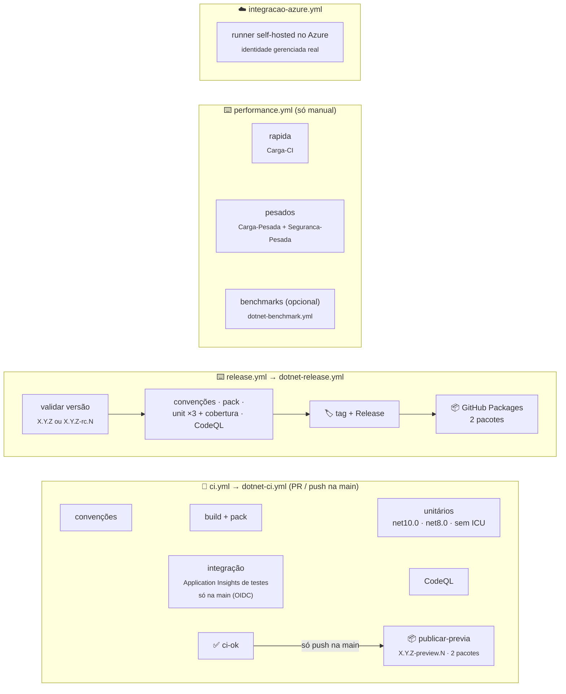

[🏠 TEC.Observability](../../README.md) › [📚 Documentação](../../docs/README.md) › ⚙️ CI/CD

# ⚙️ CI/CD e publicação

> Os workflows do TEC.Observability são curtos: `ci.yml`, `release.yml` e `performance.yml` chamam os workflows
> reutilizáveis do [tec-workflows](https://github.com/tudoemcodigo/tec-workflows) e só declaram o que é deste repositório
> (solução, testes, parâmetros de carga e Variables do Azure). O `integracao-azure.yml` cobre o único cenário que o CI
> central não cobre: identidade gerenciada real num runner dentro do Azure.

## 📑 Sumário

- [🎯 Visão geral](#-visão-geral)
- [📂 Arquivos](#-arquivos)
- [🔀 ci.yml](#-ciyml)
- [📦 release.yml](#-releaseyml)
- [⏱️ performance.yml](#️-performanceyml)
- [☁️ integracao-azure.yml](#️-integracao-azureyml)
- [🔑 Variables e Secrets](#-variables-e-secrets)
- [🚀 Como publicar](#-como-publicar)
- [🛡️ Segurança](#️-segurança)
- [❓ Solução de problemas](#-solução-de-problemas)

---

## 🎯 Visão geral



| Evento | Workflow | O que roda | Publica? |
|---|---|---|:---:|
| `pull_request` para a `main` / `merge_group` | `ci.yml` | Convenções, build + pack, unitários em matriz, integração (pula: sem OIDC em PR), CodeQL → check `ci-ok` | ❌ |
| `push` na `main` (merge) | `ci.yml` | O mesmo, **com** o Application Insights de testes via OIDC, e, com `ci-ok` verde, `publicar-previa` | ✅ `<Version>-preview.N` |
| `schedule` segunda 06:00 UTC / manual | `ci.yml` | O mesmo na `main`, **com** o Application Insights de testes via OIDC; CodeQL e auditoria com regras e vulnerabilidades novas | ❌ |
| `schedule` domingo 06:00 UTC / manual | `integracao-azure.yml` | Integração com identidade gerenciada real (runner self-hosted), se `TEC_RUNNER_AZURE=true` | ❌ |
| Manual (**Performance**) | `performance.yml` | Input `suite`: `pesadas` (padrão, `Carga-Pesada` + `Seguranca-Pesada`), `rapida` (`Carga-CI`) ou `todas`; parâmetros e, se pedido, benchmarks | ❌ |
| Manual (**Publicar versão**) | `release.yml` | Convenções, pack, unitários ×3 + cobertura e CodeQL, depois tag, Release e push dos 2 pacotes | ✅ `X.Y.Z` ou `-rc.N` |

Os testes de carga e o `Seguranca-Pesada` não rodam no PR nem na publicação: tempo de parede em runner compartilhado é
ruidoso e não pode bloquear PR nem versão.

> [!NOTE]
> O antigo `codeql.yml` e o script `.github/scripts/resumo-testes.py` foram **removidos**: o CodeQL roda dentro do CI
> central (`dotnet-ci.yml`) e o resumo dos testes é feito pela action `test-summary` do tec-workflows.

---

## 📂 Arquivos

| Arquivo | Função |
|---|---|
| [`ci.yml`](ci.yml) | Validação de PR, do push na `main` (com publicação da prévia) e semanal na `main`, com `dotnet-ci.yml@v1` |
| [`release.yml`](release.yml) | Publicação de versão estável ou `-rc.N`, com `dotnet-release.yml@v1` |
| [`performance.yml`](performance.yml) | Testes de carga só sob demanda, manual (`dotnet-test.yml@v1`), e benchmarks (`dotnet-benchmark.yml@v1`) |
| [`integracao-azure.yml`](integracao-azure.yml) | Integração com identidade gerenciada real, em runner self-hosted (job próprio, sem workflow reutilizável) |
| [`../actionlint.yaml`](../actionlint.yaml) | Declara o rótulo `azure` do runner self-hosted para o actionlint |
| [`../dependabot.yml`](../dependabot.yml) · [`../zizmor.yml`](../zizmor.yml) | Canônicos do tec-workflows (atualizações semanais com cooldown; auditoria dos workflows) |

---

## 🔀 ci.yml

| Entrada | Valor |
|---|---|
| `solution` | `TEC.Observability.slnx` |
| `private-feed` | `true` (o `TEC.Vault.AzureKeyVault` dos testes vem do `tec-interno`) |
| `unit-tests` | `TEC.Observability.Tests` (projeto inteiro: os `[Explicit]` ficam de fora) e `TEC.Observability.Azure.Tests /*/*/*/*[Category!=Integracao]` |
| `integration-tests` | `TEC.Observability.Azure.Tests /*/*/*/*[Category=Integracao]` |
| `azure-client-id` / `azure-tenant-id` | `vars.AZURE_CLIENT_ID` / `vars.TEC_TESTES_TENANT_ID` |
| `azure-env` | `TEC_TESTES_VAULT_URI` e `TEC_TESTES_TENANT_ID`, aplicados só depois do login OIDC |
| secret `test-env` | `TEC_TESTES_OBSERVABILITY_APPINSIGHTS_CONNECTION_STRING` ← secret `TEC_OBSERVABILITY_APPINSIGHTS_CONNECTION_STRING` (opcional) |

A integração faz login OIDC **só na `main` e fora de PR** (push na `main`, agendamento semanal ou disparo manual). Em
PR, sem `TEC_TESTES_VAULT_URI`, os testes de integração se pulam com o motivo. Com o login, a connection string vem do
segredo `tec-testes-appinsights-conexao` do cofre de testes; o secret do repositório só é usado se o cofre não tiver o
segredo.

- Gatilhos: `pull_request` e `merge_group` para a `main`, `push` na `main`, `schedule` (segunda 06:00 UTC) e manual.
- No push na `main`, depois do `ci-ok` verde, o job `publicar-previa` publica os 2 pacotes como
  `<Version do Directory.Build.props>-preview.N` (N sequencial por versão, reinicia a cada nova `<Version>`; ex.: `0.0.1-preview.3`); para isso o job recebe
  `packages: write`. Se a tag `v<Version>` já existe, o CI não falha: valida tudo normalmente, o `build + pack` emite
  um `::notice::` e o `publicar-previa` é pulado (suba a `<Version>` para voltar a gerar prévias). Em PR nada é
  publicado.
- Sem testes de carga: `Carga-CI`, `Carga-Pesada` e `Seguranca-Pesada` ficam no `performance.yml`.

---

## 📦 release.yml

Disparo manual (**Actions → Publicar versão → Run workflow**) com a entrada `versao` (ex.: `0.0.1` ou `0.1.0-rc.1`;
prévias saem do `ci.yml` no push na `main`).

| Entrada | Valor |
|---|---|
| `version` | `inputs.versao` |
| `solution` / `private-feed` / `unit-tests` | Os mesmos do `ci.yml` |

Ordem: validar a versão → portões em paralelo (convenções, pack, unitários ×3 com relatório de cobertura, CodeQL) → tag
`vX.Y.Z` + GitHub Release → push de `TEC.Observability` e `TEC.Observability.Azure` (mesma versão) no GitHub Packages.
Sem integração (já passou no PR e no push da `main`) e sem carga. Nada é publicado se um portão falhar. Permissões:
`contents: write` (tag/Release), `packages: write`, `id-token: write` (exigido pelo workflow de testes reutilizável).

---

## ⏱️ performance.yml

Só manual (`workflow_dispatch`, com parâmetros). Nada daqui roda no PR ou na publicação: tempo de parede em runner
compartilhado é ruidoso e não pode bloquear PR nem versão.

| Parâmetro manual | Padrão | Variável |
|---|---|---|
| `suite` | `pesadas` | `pesadas` (job `pesados`), `rapida` (job `rapida`) ou `todas` |
| `soak_segundos` | `600` | `TEC_CARGA_SOAK_SEGUNDOS` |
| `api_segundos` | `120` | `TEC_CARGA_API_SEGUNDOS` |
| `api_concorrencia` | `64` | `TEC_CARGA_API_CONCORRENCIA` |
| `health_concorrencia` | `256` | `TEC_CARGA_HEALTH_CONCORRENCIA` |
| `logs` | `1000000` | `TEC_CARGA_LOGS` |
| `fuzz_casos` | `20000` | `TEC_CARGA_FUZZ_CASOS` |
| `benchmarks` | `false` | Liga o job `benchmarks` (`TEC.Observability.Benchmarks`) |
| `benchmark_filtro` | `*` | Filtro do BenchmarkDotNet |

Job `rapida`: `TEC.Observability.LoadTests [Carga-CI]` (segundos), artefato `carga`. Job `pesados`: `Carga-Pesada`
(LoadTests) + `Seguranca-Pesada` (fuzzing estendido), timeout de 120 min, artefato `pesados`; os relatórios `carga.md`
e `seguranca.md` (`TEC_CARGA_RELATORIOS`, definida pelo CI) vão para o resumo da execução.

---

## ☁️ integracao-azure.yml

Único cenário fora do CI central: a aplicação de teste sobe como `Production` e a biblioteca só aceita Workload/Managed
Identity, o que exige um runner **dentro do Azure** com identidade real.

| Item | Valor |
|---|---|
| Gatilhos | `schedule` domingo 06:00 UTC e `workflow_dispatch` |
| Condição | `vars.TEC_RUNNER_AZURE == 'true'` **e** `github.ref == 'refs/heads/main'` (sem runner provisionado, o job é pulado em vez de ficar na fila) |
| Runner | `[self-hosted, azure]` (rótulo declarado em `.github/actionlint.yaml`) |
| Environment | `integracao-azure` (proteções do repositório: só `main`, revisores opcionais) |
| Permissões | `contents: read`, `packages: read` (credencial do feed para o `TEC.Vault.AzureKeyVault`) |
| Testes | `TEC.Observability.Azure.Tests`, `net10.0`, `[Category=Integracao]`, com `TEC_TESTES_OBSERVABILITY_IDENTIDADE=workload` |
| Variáveis do job | `TEC_TESTES_VAULT_URI`, `TEC_TESTES_TENANT_ID` (Variables) e `TEC_TESTES_OBSERVABILITY_APPINSIGHTS_CONNECTION_STRING` (secret opcional) |

A credencial do feed fica numa cópia do `nuget.config` em `$RUNNER_TEMP`, usada só no restore e apagada no fim (o runner
é self-hosted: nada pode sobreviver ao job). Não marque esse workflow como check obrigatório.

**Preparar o runner (uma vez):**

1. Runner self-hosted no Azure (AKS com Workload Identity, VM ou Container Apps com Managed Identity) com os rótulos
   `self-hosted` e `azure`, **efêmero** e num *runner group* restrito a este repositório e a este workflow.
2. Environment `integracao-azure` com *Deployment branches* = só `main`.
3. Papéis da identidade do runner: **Monitoring Metrics Publisher** e **Monitoring Reader** no Application Insights de
   testes; **Key Vault Secrets User** no cofre de testes.
4. Variable do repositório `TEC_RUNNER_AZURE` = `true`.

> [!CAUTION]
> Um runner self-hosted com identidade no Azure executa o código do repositório. Nunca o use em workflows de
> `pull_request`, não o deixe persistente nem num runner group compartilhado.

---

## 🔑 Variables e Secrets

| Nome | Tipo | Onde | Uso |
|---|---|---|---|
| `AZURE_CLIENT_ID` | Variable | Organização | Identidade de testes para o login OIDC (credencial federada `repo:tudoemcodigo/lib-tec-observability:ref:refs/heads/main`) |
| `TEC_TESTES_TENANT_ID` | Variable | Organização | Tenant do login e dos testes |
| `TEC_TESTES_VAULT_URI` | Variable | Organização | Cofre de testes (segredo `tec-testes-appinsights-conexao`) |
| `TEC_OBSERVABILITY_APPINSIGHTS_CONNECTION_STRING` | Secret (opcional) | Repositório | Repassado aos testes como `TEC_TESTES_OBSERVABILITY_APPINSIGHTS_CONNECTION_STRING`; usado só sem o segredo do cofre |
| `TEC_RUNNER_AZURE` | Variable | Repositório | `true` liga o `integracao-azure.yml` |
| `PACKAGES_READ_TOKEN` | Secret do Dependabot | Organização | PAT *classic* `read:packages` para o Dependabot ler o `tec-interno` |

Papéis da identidade de testes (`AZURE_CLIENT_ID`): **Monitoring Metrics Publisher** e **Monitoring Reader** no
Application Insights de testes (recomendado: autenticação local desativada, para o teste por Entra ID ser conclusivo) e
**Key Vault Secrets User** no cofre de testes.

---

## 🚀 Como publicar

1. Confirme que `Directory.Build.props` tem a versão desejada e que o CHANGELOG tem a entrada.
2. Com o `TEC.Vault.AzureKeyVault` publicado, regenere o lock file em modo pacote e faça commit:
   ```bash
   dotnet restore TEC.Observability.slnx --force-evaluate
   ```
3. PR → `ci / ci-ok` verde → merge. O CI do push na `main` publica a prévia `<Version>-preview.N`.
4. Versão estável ou rc: **Actions → Publicar versão → Run workflow** → `versao` (ex.: `0.0.1` ou `0.0.1-rc.1`).
5. Na primeira publicação: *Package settings* de cada pacote → visibilidade e acesso dos repositórios da organização.
6. Para gerar novas prévias depois de publicar `X.Y.Z`, suba a `<Version>` do `Directory.Build.props` para a próxima
   (com a tag `v<Version>` existente, o CI da `main` valida tudo, mas não publica prévia até esse ajuste).

Ordem do ecossistema: Core → Vault → Cqrs → Security → **Observability** → ORM.

---

## 🛡️ Segurança

| Controle | Como |
|---|---|
| Menor privilégio | Padrão `contents: read`; `packages: write`/`contents: write` só na release e `packages: write` no `publicar-previa` (push na `main`); `id-token: write` só nos jobs de teste |
| Actions fixadas por SHA | Atualizadas pelo Dependabot (cooldown); `zizmor` audita os workflows |
| Sem credencial no disco | `persist-credentials: false`; no self-hosted, credencial do feed em arquivo temporário apagado no fim |
| Azure sem segredo | OIDC, só na `main` e fora de PR; self-hosted só com identidade gerenciada |
| Sem pacote órfão | Tag + Release antes do push no feed; release só com **todos** os portões verdes |
| Cadeia de suprimentos | `restore --locked-mode`, `NuGetAudit` como erro, `packageSourceMapping` |

---

## ❓ Solução de problemas

<details>
<summary>Os testes de integração aparecem como pulados no PR</summary>

Esperado: o login OIDC só acontece na `main` fora de PR. Rode o `ci.yml` manualmente na `main` ou aguarde o push do
merge ou o agendamento.

</details>

<details>
<summary>Push na <code>main</code> não gerou prévia</summary>

A `<Version>` do `Directory.Build.props` já foi lançada (a tag `v<Version>` existe). O CI não falha: valida tudo
(convenções, build + pack, testes, CodeQL, `ci-ok`), o `build + pack` emite o aviso *"A versão X já foi publicada (tag
vX): nenhuma prévia gerada..."* e o `publicar-previa` é pulado. É o esperado quando o componente fica numa versão
publicada e recebe só correções. Para voltar a gerar prévias, abra um PR subindo a `<Version>` para a próxima.

</details>

<details>
<summary>O job do <code>integracao-azure.yml</code> foi pulado</summary>

Falta a Variable `TEC_RUNNER_AZURE=true` ou o disparo não foi na `main`.

</details>

<details>
<summary><code>NU1101</code> para <code>TEC.Vault.AzureKeyVault</code></summary>

O pacote ainda não está no feed na versão declarada no `Directory.Packages.props`. Publique o TEC.Vault primeiro e
regenere o `packages.lock.json` com `dotnet restore TEC.Observability.slnx --force-evaluate`.

</details>

<details>
<summary>Testes de identidade pulados no self-hosted com "Sem Workload/Managed Identity disponível"</summary>

A identidade do runner não está acessível ou não tem os papéis. Confira a federação (AKS) ou a Managed Identity da VM.

</details>

---
⬅️ [Desenvolvimento local](../../docs/desenvolvimento.md) · [📚 Índice](../../docs/README.md) · [README](../../README.md) ➡️
