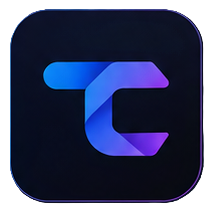
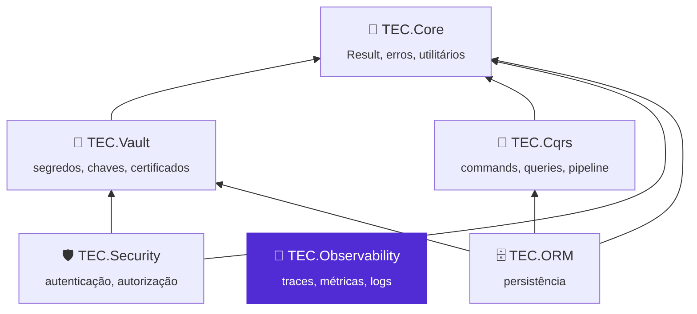
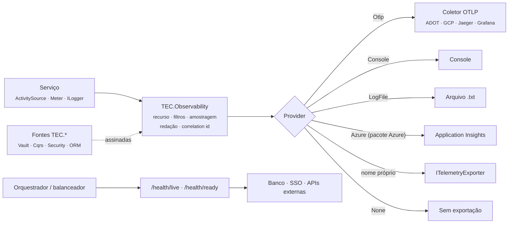

<div align="center">



# 📡 TEC.Observability

**Deixa cada serviço observável do mesmo jeito: rastreia as requisições, coleta métricas e logs, correlaciona chamadas entre serviços e informa a saúde do serviço e das dependências, com o destino da telemetria escolhido só por configuração.**

OpenTelemetry · OTLP, Azure Monitor, console ou arquivo · Exportadores plugáveis · Liveness e readiness em JSON · Correlation ID · Redação de dados sensíveis · .NET 8 e 10 · Native AOT

[](https://github.com/tudoemcodigo/lib-tec-observability/actions/workflows/ci.yml)
[](#-compatibilidade)
[](#-compatibilidade)
[](CHANGELOG.md)
[](LICENSE)

[📥 Instalação](#-instalação) · [🚀 Início rápido](#-início-rápido) · [📚 Documentação](docs/README.md) · [📝 Changelog](CHANGELOG.md) · [⚙️ CI/CD](.github/workflows/README.md)

</div>

---

## 📑 Sumário

- [✨ Por que usar](#-por-que-usar)
- [📦 Pacotes](#-pacotes)
- [🧬 Ecossistema TEC](#-ecossistema-tec)
- [📥 Instalação](#-instalação)
- [🚀 Início rápido](#-início-rápido)
- [🗺️ Como funciona](#️-como-funciona)
- [📚 Documentação](#-documentação)
- [⚡ Compatibilidade](#-compatibilidade)
- [🛡️ Segurança](#️-segurança)
- [🧪 Testes](#-testes)
- [🤝 Contribuição](#-contribuição)
- [🏷️ Versionamento](#️-versionamento)
- [📄 Licença](#-licença)

---

## ✨ Por que usar

| Sem o TEC.Observability | Com o TEC.Observability |
|---|---|
| Cada serviço monta o OpenTelemetry do seu jeito, com recurso, filtros e amostragem diferentes | Uma chamada (`AddTecObservability`) monta o mesmo pipeline em todos os serviços; o negócio usa só `ActivitySource`, `Meter` e `ILogger` da BCL |
| Trocar de backend (Azure → AWS/GCP/Jaeger) exige mudar código e dependências | `Observability:Provider` escolhe `Otlp`, `Console`, `LogFile`, `None`, `Azure` ou um exportador próprio — um ou vários ao mesmo tempo (`"Otlp, LogFile"`) |
| O pacote traz SDKs de todas as nuvens | O pacote base depende só do OpenTelemetry e é compatível com Native AOT; o Azure Monitor vem num pacote separado |
| Cada serviço tem um `/health` diferente, que às vezes reinicia o pod porque o banco caiu | `/health/live` (só o processo) e `/health/ready` (dependências), o mesmo JSON em todos os serviços, com cache, execução única e prazo |
| Sondagens de health check e Swagger enchem o backend de traces | Rotas ignoradas e as chamadas HTTP dos próprios health checks não geram span |
| `X-Correlation-ID` repassado à mão — e às vezes vazado para terceiros | Correlation id ligado ao trace W3C e aos logs, propagado só aos hosts autorizados (`BaggageAllowedHosts`) |
| Token na query string, senha em connection string e nome de segredo indo para o backend | Redação antes de qualquer exportador: query string, credenciais em URL, atributos de nome sensível, `Bearer`/`Basic` e pares `chave=valor` sensíveis em spans e logs |

- ✅ **Configuração validada na subida** (`ValidateOnStart`): `Provider` sem exportador, endpoint inválido, cabeçalho OTLP em `http` ou health check mais longo que o prazo derrubam a inicialização, não a primeira requisição.
- ✅ **Seguro por padrão:** fora de `Development` o JSON de health traz só status e horário; Baggage do cliente descartado; arquivo de log à prova de *log forging*.
- ✅ **Não acopla:** nenhum componente TEC depende dele, e ele não depende de nenhum — só assina as fontes `TEC.*` da BCL. Convive com o .NET Aspire `ServiceDefaults`.

## 📦 Pacotes

| Pacote | Para que serve | Quando instalar | Depende de |
|---|---|---|---|
| [`TEC.Observability`](TEC.Observability/README.md) | Pipeline de traces, métricas e logs; exportadores `Otlp`, `Console`, `LogFile` e `None`, combináveis; `ITelemetryExporter`; health checks (liveness, readiness, banco, SSO, APIs); correlation id; redação | Sempre | OpenTelemetry (SDK, OTLP, console, instrumentações ASP.NET Core, HttpClient e runtime) e o shared framework do ASP.NET Core. **Nenhum componente TEC** |
| [`TEC.Observability.Azure`](TEC.Observability.Azure/README.md) | `Provider: Azure`: exportador do Azure Monitor / Application Insights (`.AddAzureMonitorExporter()`), ingestão por chave ou Entra ID | Só quando algum ambiente exporta para o Azure Monitor | `TEC.Observability` (mesma versão), `Azure.Monitor.OpenTelemetry.AspNetCore`, `Azure.Identity` |

> [!IMPORTANT]
> **Use os dois pacotes na mesma versão.** O `TEC.Observability.Azure` usa tipos internos do núcleo e os dois saem juntos,
> a cada release. O pacote Azure **não** é compatível com Native AOT (o SDK do Azure Monitor gera avisos de trimming).

## 🧬 Ecossistema TEC



O TEC.Observability **não depende de nenhum TEC.\*** em produção e **nenhum componente depende dele**. Cada componente
emite `ActivitySource` e `Meter` da BCL com o nome `TEC.<Componente>`; o TEC.Observability apenas assina o prefixo
`TEC.*` ([detalhes](docs/integracoes-tec.md)).

| Componente | Relação com o TEC.Observability |
|---|---|
| 🧰 [TEC.Core](https://github.com/tudoemcodigo/lib-tec-core) | Independente; pode ser usado no mesmo serviço |
| 🔐 [TEC.Vault](https://github.com/tudoemcodigo/lib-tec-vault) | Fontes `TEC.Vault` assinadas; chamadas a cofres do Azure fora dos traces; `Otlp:Headers` e `Azure:ConnectionString` podem vir do cofre; health check do cofre no `/health/ready` |
| 🧭 [TEC.Cqrs](https://github.com/tudoemcodigo/lib-tec-cqrs) | Fontes `TEC.Cqrs` assinadas: spans do pipeline no mesmo trace da requisição |
| 🛡️ [TEC.Security](https://github.com/tudoemcodigo/lib-tec-security) | Fontes `TEC.Security` assinadas; o provedor de identidade pode entrar no readiness (`AddSsoHealthCheck`) |
| 🗄️ [TEC.ORM](https://github.com/tudoemcodigo/lib-tec-orm) | Fontes `TEC.ORM` assinadas; o banco pode entrar no readiness (`AddDatabaseHealthCheck`) |

## 📥 Instalação

Os pacotes estão no **GitHub Packages** da organização `tudoemcodigo`, que exige autenticação mesmo para leitura. Crie um
PAT *classic* com o escopo `read:packages`, registre a origem com o nome `tec-interno` e instale:

```bash
dotnet nuget add source https://nuget.pkg.github.com/tudoemcodigo/index.json -n tec-interno -u <usuario> -p <PAT>

dotnet add package TEC.Observability --version 0.0.1
dotnet add package TEC.Observability.Azure --version 0.0.1   # só se algum ambiente exportar para o Azure Monitor
```

> [!IMPORTANT]
> Versão atual: **0.0.1** (ainda não publicada). Para evitar *dependency confusion*, mapeie `TEC.*` só para a origem
> `tec-interno` no `nuget.config` da aplicação (`packageSourceMapping`).

## 🚀 Início rápido

**1. Configure a seção `Observability`** no `appsettings.json`:

```json
{
  "Observability": {
    "ServiceName": "pedidos-api",
    "Environment": "development",
    "Provider": "Console"
  }
}
```

**2. Registre a observabilidade e os health checks** no `Program.cs`:

```csharp
using Microsoft.Data.SqlClient;
using Microsoft.Extensions.Diagnostics.HealthChecks;
using TEC.Observability.DependencyInjection;

var builder = WebApplication.CreateBuilder(args);

// ServiceVersion vazio: vale o AssemblyInformationalVersion do assembly de entrada
builder.Services.AddTecObservability(builder.Configuration)
    .AddDatabaseHealthCheck("PrimaryDb", SqlClientFactory.Instance, builder.Configuration.GetConnectionString("Default")!)
    .AddSsoHealthCheck("KeycloakSSO", new Uri("https://sso.empresa.com/realms/tec"))
    .AddExternalServiceHealthCheck("PaymentGateway", new Uri("https://pagamentos.empresa.com/health/live"),
        o => o.FailureStatus = HealthStatus.Degraded);

var app = builder.Build();
app.UseTecObservability();   // correlation id + /health/live + /health/ready (no início do pipeline)

app.MapGet("/", () => "ok");
app.Run();
```

**3. Rode:** as requisições aparecem no console como spans, `GET /health/live` responde `200` e `GET /health/ready`
mostra o estado das dependências. Para cada ambiente, troque só o `Provider` no `appsettings.{Ambiente}.json`:

```json
{ "Observability": { "Provider": "Otlp, LogFile", "Otlp": { "Endpoint": "https://otel-collector:4317" } } }
```

> [!TIP]
> Com o pacote Azure, `builder.Services.AddTecObservability(builder.Configuration).AddAzureMonitorExporter()` no mesmo
> `Program.cs` liga o Azure Monitor só nos ambientes com `Azure` no `Provider`. Detalhes em
> [📤 Exportadores](docs/exportadores.md).

## 🗺️ Como funciona



| Peça | Papel |
|---|---|
| `AddTecObservability` | Registra opções e validação, pipeline OpenTelemetry, redação, exportadores do `Provider`, liveness e infraestrutura dos health checks; devolve o `ObservabilityBuilder` |
| `ObservabilityBuilder` | Encadeia `AddExporter`, `AddActivitySource`, `AddMeter`, `AddDatabaseHealthCheck`, `AddSsoHealthCheck`, `AddExternalServiceHealthCheck` |
| `UseTecObservability` | `UseCorrelationId` (middleware) + `MapTecHealthChecks` (endpoints) |
| `HealthCheckResponseWriter` | JSON padronizado, também para endpoints próprios (`HealthCheckOptions.ResponseWriter`) |
| `CorrelationId` | Nomes (`X-Correlation-ID`, `correlation.id`) e valor da requisição atual |
| `ITelemetryExporter` | Ponto de extensão para backends de telemetria |
| `AddAzureMonitorExporter` | Exportador do Azure Monitor (pacote `TEC.Observability.Azure`, mesmos namespaces) |

## 📚 Documentação

| Arquivo | O que responde |
|---|---|
| [⚙️ Configuração](docs/configuracao.md) | Como registrar, a ordem dos provedores de configuração, todas as opções, a validação na subida e o estado global do processo |
| [📤 Exportadores](docs/exportadores.md) | OTLP, Azure Monitor, console, `None`, arquivo de logs, vários destinos e exportador próprio |
| [📊 Traces, métricas e logs](docs/traces-metricas-logs.md) | O que o pipeline registra, recurso, amostragem, rotas ignoradas e telemetria de negócio |
| [🧹 Redação de dados sensíveis](docs/redacao.md) | O que é redigido em logs, spans, arquivo e health checks — e o que não é |
| [❤️ Health checks](docs/health-checks.md) | Liveness/readiness, banco, SSO, APIs externas, cache, prazo, porta de gerência e JSON |
| [🔗 Correlation id](docs/correlation-id.md) | `X-Correlation-ID`, Baggage, `BaggageAllowedHosts` e `AllowInboundBaggage` |
| [🤝 .NET Aspire](docs/aspire.md) | Convivência com o `ServiceDefaults`, variáveis `OTEL_*` e quem exporta |
| [🧭 Integrações TEC](docs/integracoes-tec.md) | Por que não há dependência, fontes `TEC.*`, segredos no TEC.Vault e health check do cofre |
| [🛡️ Segurança](docs/seguranca.md) | Modelo de ameaças, garantias, responsabilidades, `traceparent` externo e configuração de produção |
| [🧪 Testes](docs/testes.md) | Suítes, categorias, como rodar local e as variáveis `TEC_TESTES_*`/`TEC_CARGA_*` |
| [💻 Desenvolvimento local](docs/desenvolvimento.md) | Compilar (feed `tec-interno` por padrão, repositórios vizinhos sob demanda), lock files e samples |
| [🧰 Samples](samples/README.md) | API de exemplo e gerador de carga HTTP |
| [⚙️ CI/CD](.github/workflows/README.md) | Workflows, gatilhos, Variables/Secrets e como publicar |

## ⚡ Compatibilidade

| Item | Suporte |
|---|---|
| .NET | `net8.0` e `net10.0` (LTS); a aplicação é ASP.NET Core (`Microsoft.AspNetCore.App`) |
| Native AOT / trimming | ✅ `TEC.Observability` (`IsAotCompatible`, binding de configuração gerado em compilação, JSON com `Utf8JsonWriter`) · ❌ `TEC.Observability.Azure` (a distro `Azure.Monitor.OpenTelemetry.AspNetCore` gera IL2026/IL3050) |
| Sem ICU (`InvariantGlobalization`) | ✅ testado no CI |
| Backends | Qualquer coletor OTLP (gRPC ou HTTP/protobuf), Azure Monitor, console, arquivo local ou exportador próprio |
| .NET Aspire | Convive com o `ServiceDefaults` ([aspire.md](docs/aspire.md)) |
| Sistemas | Windows, Linux e macOS |

> [!NOTE]
> No .NET 8, as sondas de health entram na métrica `http.server.request.duration` (identificáveis por `http.route`):
> `DisableHttpMetrics` só existe a partir do .NET 9.

## 🛡️ Segurança

Seguro por padrão: configuração insegura recusada na subida (cabeçalhos OTLP em `http`, credencial em URL, detalhes de
health sem porta de gerência), JSON de health mínimo fora de `Development`, correlation id validado, Baggage do cliente
descartado e enviado só a hosts permitidos, redação de dados sensíveis antes de qualquer exportador, sondagens sem
redirecionamento nem cabeçalhos de trace e arquivo de log com caracteres de controle escapados.

> [!WARNING]
> A redação é uma **heurística que prefere esconder a vazar**: pode redigir demais (ex.: `token: expirado` vira
> `token: Redacted`) e não cobre escopos de log (`BeginScope`) nos exportadores OTLP/Azure/Console nem eventos de span
> (`RecordException`). Não registre segredos de
> propósito. Detalhes em [🧹 Redação](docs/redacao.md) e [🛡️ Segurança](docs/seguranca.md).
> Vulnerabilidades: não abra *issue* pública; escreva para [roberto@roberto.inf.br](mailto:roberto@roberto.inf.br).

## 🧪 Testes

```bash
dotnet test --project TEC.Observability.Tests -c Release                                                          # unitários do pacote base
dotnet test --project TEC.Observability.Azure.Tests -c Release --treenode-filter "/*/*/*/*[Category!=Integracao]"  # unitários do pacote Azure
dotnet test --project TEC.Observability.LoadTests -c Release --treenode-filter "/*/*/*/*[Category=Carga-CI]"      # carga rápida
```

323 testes no `TEC.Observability.Tests` (em `net10.0`, `net8.0` e sem ICU: regressão, segurança, fuzzing, DoS e
vazamento), 29 unitários e 3 de integração (Application Insights real) no `TEC.Observability.Azure.Tests`, 5 de carga
rápida (`Carga-CI`) e as suítes pesadas (`Carga-Pesada` e 1 `Seguranca-Pesada`, o fuzzing estendido), estas de carga só
sob demanda no `performance.yml` manual. Detalhes em [docs/testes.md](docs/testes.md).

## 🤝 Contribuição

Branch a partir da `main` → código **e** testes (inclusive a entrada hostil e o caminho de falha) → `dotnet test` nos dois
alvos → CHANGELOG e `docs/` atualizados → pull request com o check `ci / ci-ok` verde. Como compilar (credencial do feed
`tec-interno`, modo local com `-p:TecUseLocalProjects=true`): [docs/desenvolvimento.md](docs/desenvolvimento.md).

## 🏷️ Versionamento

[SemVer](https://semver.org/lang/pt-BR/), **uma versão para os dois pacotes** (`Directory.Build.props`), sempre publicados
juntos. Enquanto for `0.x`, mudanças incompatíveis podem ocorrer em versões MINOR. Cada merge na `main` publica a prévia
`<Version>-preview.N`; versões estáveis e `-rc.N` saem só pelo workflow **Publicar versão**
([CI/CD](.github/workflows/README.md)).

## 📄 Licença

[MIT](LICENSE) · Criado e mantido por **Roberto Oliveira**, equipe **Tudo em Código** · [github.com/tudoemcodigo](https://github.com/tudoemcodigo)
