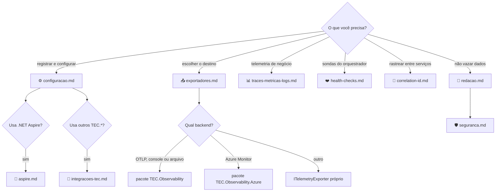

[🏠 TEC.Observability](../README.md) › 📚 Documentação

# 📚 Documentação do TEC.Observability

> Referência dos pacotes **TEC.Observability** e **TEC.Observability.Azure**: cada tema num arquivo, com exemplos que
> compilam com a API atual, opções, erros e armadilhas de segurança.

## 📑 Sumário

- [🗂️ Temas](#️-temas)
- [🗺️ Mapa](#️-mapa)
- [📐 Convenções](#-convenções)

---

## 🗂️ Temas

| # | Arquivo | O que responde | Tipos principais |
|:-:|---|---|---|
| 1 | [⚙️ Configuração](configuracao.md) | Como registrar, em que ordem a configuração vale, todas as opções, validação na subida, estado global | `AddTecObservability`, `ObservabilityBuilder`, `ObservabilityOptions`, `UseTecObservability` |
| 2 | [📤 Exportadores](exportadores.md) | OTLP, Azure Monitor, console, `None`, arquivo de logs, vários destinos, exportador próprio | `ObservabilityProvider`, `OtlpExporterSettings`, `LogFileExporterSettings`, `AzureMonitorExporterOptions`, `ITelemetryExporter` |
| 3 | [📊 Traces, métricas e logs](traces-metricas-logs.md) | O que o pipeline registra, recurso, amostragem, rotas ignoradas, telemetria de negócio | `AddActivitySource`, `AddMeter`, `TecTelemetryPrefix` |
| 4 | [🧹 Redação de dados sensíveis](redacao.md) | O que sai redigido de logs, spans, arquivo e health checks — e os limites da heurística | (interno: `LogRedactionProcessor`, `SpanRedactionProcessor`) |
| 5 | [❤️ Health checks](health-checks.md) | Liveness/readiness, banco, SSO, APIs, cache, prazo, porta de gerência e JSON | `MapTecHealthChecks`, `HealthCheckTags`, `HttpHealthCheckOptions`, `HealthCheckResponseWriter` |
| 6 | [🔗 Correlation id](correlation-id.md) | Como o `X-Correlation-ID` é aceito, propagado e protegido | `CorrelationId`, `UseCorrelationId` |
| 7 | [🤝 .NET Aspire](aspire.md) | Como conviver com o `ServiceDefaults` e quem exporta | `ObservabilityHealthChecksOptions` |
| 8 | [🧭 Integrações TEC](integracoes-tec.md) | Por que não há dependência entre componentes, fontes `TEC.*`, TEC.Vault | `TecTelemetryPrefix` |
| 9 | [🛡️ Segurança](seguranca.md) | Modelo de ameaças, garantias, responsabilidades, estado global, configuração de produção | — |
| 10 | [🧪 Testes](testes.md) | Suítes, categorias, como rodar local, variáveis `TEC_TESTES_*`/`TEC_CARGA_*` | — |
| 11 | [💻 Desenvolvimento local](desenvolvimento.md) | Compilar (feed `tec-interno` por padrão, repositórios vizinhos sob demanda), lock files, samples | — |
| — | [🧰 Samples](../samples/README.md) | API de exemplo e gerador de carga | — |
| — | [⚙️ CI/CD](../.github/workflows/README.md) | Workflows, Variables/Secrets e publicação | — |

---

## 🗺️ Mapa

---

## 📐 Convenções

- **Fonte da verdade é o código:** nomes, padrões e mensagens foram conferidos no código de `TEC.Observability` e
  `TEC.Observability.Azure`.
- **Chaves de configuração** são relativas à seção `Observability` (ex.: `HealthChecks:Timeout` =
  `Observability:HealthChecks:Timeout`; por variável de ambiente, `Observability__HealthChecks__Timeout`).
- **Erros:** o componente não usa `Result`. Configuração inválida vira `OptionsValidationException` na subida
  (`ValidateOnStart`); uso incorreto da API vira `ArgumentException`/`InvalidOperationException` no registro; o estado das
  dependências vira código HTTP nos endpoints de health.
- **Placeholders** entre `< >` (ex.: `<nome-do-cofre>`, `<tenant-id>`) devem ser trocados pelos do seu ambiente.
- **Alertas:** `[!NOTE]` comportamento, `[!TIP]` boa prática, `[!IMPORTANT]` requisito, `[!WARNING]` armadilha,
  `[!CAUTION]` risco de segurança.

---
⬅️ [README](../README.md) · [📚 Índice](README.md) · [Configuração](configuracao.md) ➡️
