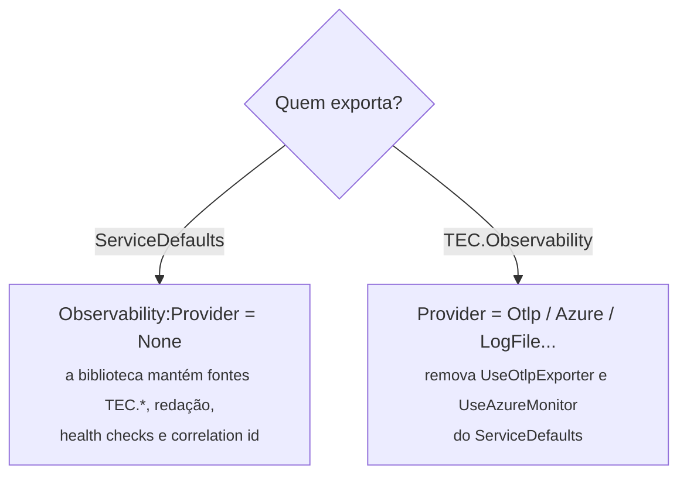

[🏠 TEC.Observability](../README.md) › [📚 Documentação](README.md) › 🤝 .NET Aspire

# 🤝 .NET Aspire

> Como usar o TEC.Observability junto com o projeto `ServiceDefaults` do .NET Aspire: um único exportador, sem check de
> liveness duplicado e com a redação valendo também no pipeline do Aspire.

## 📑 Sumário

- [🎯 Visão geral](#-visão-geral)
- [🚀 Uso](#-uso)
  - [ServiceDefaults exporta (recomendado)](#servicedefaults-exporta-recomendado)
  - [TEC.Observability exporta](#tecobservability-exporta)
- [⚙️ Opções](#️-opções)
- [❌ Erros](#-erros)
- [🛡️ Segurança](#️-segurança)
- [❓ Perguntas frequentes](#-perguntas-frequentes)

---

## 🎯 Visão geral



| Ponto | Comportamento |
|---|---|
| Ordem | `AddServiceDefaults()` antes ou depois do `AddTecObservability`, tanto faz |
| Liveness | O `AddServiceDefaults` registra o check `self` (tag `live`); a biblioteca não registra outro com o mesmo nome e o `/health/live` usa o do Aspire |
| Endpoints | `/health/live` e `/health/ready` convivem com `/health` e `/alive` do `MapDefaultEndpoints` (que o Aspire só mapeia em `Development`) |
| Variáveis | `OTEL_SERVICE_NAME` preenche `ServiceName`; `OTEL_EXPORTER_OTLP_*` valem com `Provider: Otlp` sem `Endpoint`/`Headers` |
| Fontes | `ServiceName` e `TEC.*` registradas no provedor do Aspire mesmo com `Provider: None` |
| Redação | Logs e spans redigidos também no pipeline do `ServiceDefaults` (os processadores entram antes dos exportadores dele) |
| Filtros de rota | Com um exportador da biblioteca ligado, compostos com os do `ServiceDefaults`. ⚠️ Com `Provider: None`, `IgnoredPaths` e o filtro das sondagens **não** são aplicados: valem só os do `ServiceDefaults` |

---

## 🚀 Uso

### ServiceDefaults exporta (recomendado)

```csharp
using Microsoft.Data.SqlClient;
using TEC.Observability.DependencyInjection;

var builder = WebApplication.CreateBuilder(args);

builder.AddServiceDefaults();   // UseOtlpExporter() quando OTEL_EXPORTER_OTLP_ENDPOINT existe

// appsettings.json: "Observability": { "Provider": "None", "Environment": "development" }
// ServiceName vem de OTEL_SERVICE_NAME, definido pelo AppHost
builder.Services.AddTecObservability(builder.Configuration)
    .AddDatabaseHealthCheck("PrimaryDb", SqlClientFactory.Instance, builder.Configuration.GetConnectionString("Default")!);

var app = builder.Build();
app.MapDefaultEndpoints();   // /health e /alive do Aspire (Development)
app.UseTecObservability();   // /health/live e /health/ready + correlation id
app.Run();
```

### TEC.Observability exporta

Remova `UseOtlpExporter()`/`UseAzureMonitor()` do `ConfigureOpenTelemetry` do `ServiceDefaults` (mantenha a
instrumentação, se quiser) e defina o `Provider`:

```json
{ "Observability": { "Environment": "production", "Provider": "Otlp" } }
```

Sem `Otlp:Endpoint`, vale o `OTEL_EXPORTER_OTLP_ENDPOINT` injetado pelo AppHost.

---

## ⚙️ Opções

| Opção | Padrão | Descrição |
|---|---|---|
| `Provider` | `None` | `None` quando o `ServiceDefaults` exporta |
| `HealthChecks:LivenessCheckName` | `self` | Nome do liveness; um check existente com esse nome é reaproveitado (precisa ter a tag `live`) |
| `HealthChecks:RegisterLivenessCheck` | `true` | `false` desliga o liveness da biblioteca |

| Variável | Usada quando | Efeito |
|---|---|---|
| `OTEL_SERVICE_NAME` | `ServiceName` vazio | Preenche `ServiceName` |
| `OTEL_EXPORTER_OTLP_ENDPOINT` / `OTEL_EXPORTER_OTLP_PROTOCOL` | `Provider: Otlp` e `Otlp:Endpoint` vazio | Endereço e protocolo do coletor (lidos pelo SDK) |
| `OTEL_EXPORTER_OTLP_HEADERS` | `Provider: Otlp` e `Otlp:Headers` vazio | Cabeçalhos (a trava de TLS também vale) |

> [!TIP]
> Renomeando o liveness da biblioteca (ex.: `"LivenessCheckName": "processo"`), os dois checks passam a existir e o
> `/health/live` executa ambos.

---

## ❌ Erros

| Exceção | Quando | O que fazer |
|---|---|---|
| `NotSupportedException` (SDK do OpenTelemetry) na subida | `UseOtlpExporter` (Aspire) e `Provider: Otlp` (`AddOtlpExporter`) no mesmo container | Um só exporta: `Provider: None` ou remova o `UseOtlpExporter` |
| `InvalidOperationException`: *Já existe um health check 'self' sem a tag 'live'...* | Check `self` registrado sem a tag `live` | Adicione `HealthCheckTags.Live`, troque `LivenessCheckName` ou desligue `RegisterLivenessCheck` |

---

## 🛡️ Segurança

> [!WARNING]
> Com `Provider: None`, `IgnoredPaths` não é aplicado: configure as rotas ignoradas também no `ServiceDefaults`, senão as
> sondas de health geram traces no backend do Aspire.

> [!NOTE]
> O dashboard do Aspire é para desenvolvimento. Em produção, siga a [configuração recomendada](seguranca.md#-configuração-recomendada-para-produção).

---

## ❓ Perguntas frequentes

<details>
<summary>Vale a pena usar os dois?</summary>

Sim: o `ServiceDefaults` cuida da exportação e da descoberta de serviços; o TEC.Observability acrescenta liveness/readiness
com cache e prazo, health checks de dependências, correlation id e redação.

</details>

---
⬅️ [Correlation id](correlation-id.md) · [📚 Índice](README.md) · [Integrações TEC](integracoes-tec.md) ➡️
