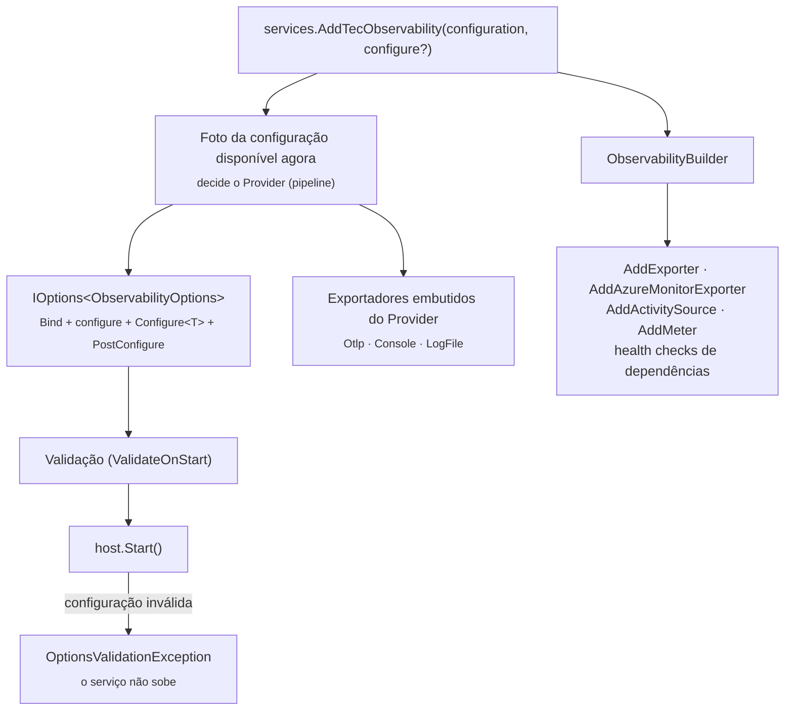

[🏠 TEC.Observability](../README.md) › [📚 Documentação](README.md) › ⚙️ Configuração

# ⚙️ Configuração

> Como registrar a observabilidade numa única chamada, em que ordem a configuração vale, quais são as opções da seção
> `Observability` e o que é validado na subida.

## 📑 Sumário

- [🎯 Visão geral](#-visão-geral)
- [🚀 Uso](#-uso)
  - [Registro](#registro)
  - [Pipeline HTTP](#pipeline-http)
  - [Ajustes em código](#ajustes-em-código)
  - [Provedores de configuração adicionados depois](#provedores-de-configuração-adicionados-depois)
  - [Exemplo completo de appsettings.json](#exemplo-completo-de-appsettingsjson)
- [⚙️ Opções](#️-opções)
- [❌ Erros](#-erros)
- [🌐 Estado global do processo](#-estado-global-do-processo)
- [🛡️ Segurança](#️-segurança)
- [❓ Perguntas frequentes](#-perguntas-frequentes)

---

## 🎯 Visão geral



| Peça | Namespace | Papel |
|---|---|---|
| `ServiceCollectionExtensions.AddTecObservability` | `TEC.Observability.DependencyInjection` | Registra opções, validação, pipeline OpenTelemetry, redação, exportadores do `Provider`, liveness e infraestrutura dos health checks |
| `ObservabilityBuilder` | `TEC.Observability.DependencyInjection` | Retorno do registro: exportadores, fontes extras e health checks |
| `ApplicationBuilderExtensions` | `TEC.Observability.DependencyInjection` | `UseTecObservability`, `UseCorrelationId`, `MapTecHealthChecks` |
| `ObservabilityOptions` e subopções | `TEC.Observability.Configuration` | Seção `Observability` do `appsettings.json` |

---

## 🚀 Uso

### Registro

```csharp
using TEC.Observability.DependencyInjection;

var builder = WebApplication.CreateBuilder(args);

builder.Services.AddTecObservability(builder.Configuration)
    .AddActivitySource("Empresa.Faturamento")   // fontes além do ServiceName e de TEC.*
    .AddMeter("Empresa.Faturamento");
```

`AddTecObservability` deve ser chamado **uma única vez**. Membros do `ObservabilityBuilder`:

| Membro | Descrição |
|---|---|
| `AddExporter(ITelemetryExporter)` | Registra um exportador; só é ligado se o nome estiver no `Provider` ([exportadores](exportadores.md#-exportador-próprio)) |
| `AddActivitySource(params string[])` / `AddMeter(params string[])` | Fontes e medidores extras (aceitam curinga, ex.: `Empresa.*`) |
| `AddDatabaseHealthCheck(...)` (3 sobrecargas) | Banco relacional, qualquer driver ADO.NET ([health checks](health-checks.md#️-banco-de-dados)) |
| `AddSsoHealthCheck(name, Uri, configure?)` | Documento de descoberta OpenID Connect |
| `AddExternalServiceHealthCheck(name, Uri, configure?)` | API externa ou microsserviço |
| `Services` / `Configuration` | Container e configuração passados ao registro |
| `Options` | Opções vistas **no registro** (em tempo de execução, use `IOptions<ObservabilityOptions>`) |
| `HealthChecks` | `IHealthChecksBuilder` nativo, para verificações próprias (use as tags de `HealthCheckTags`) |

### Pipeline HTTP

```csharp
var app = builder.Build();
app.UseTecObservability();   // no início do pipeline, antes dos middlewares e endpoints da aplicação
```

| Método | Estende | Faz |
|---|---|---|
| `UseTecObservability()` | `WebApplication` | `UseCorrelationId()` + `MapTecHealthChecks()` |
| `UseCorrelationId()` | `IApplicationBuilder` | Só o middleware de correlation id ([correlation-id.md](correlation-id.md)) |
| `MapTecHealthChecks()` | `IEndpointRouteBuilder` | Só os endpoints de liveness e readiness ([health-checks.md](health-checks.md)) |

Os três lançam `InvalidOperationException` se `AddTecObservability` não foi chamado.

### Ajustes em código

```csharp
using TEC.Observability.Configuration;
using TEC.Observability.DependencyInjection;

builder.Services.AddTecObservability(builder.Configuration, options =>
{
    // Aplicado depois do appsettings.json; pode rodar mais de uma vez (uma por leitura das opções)
    options.BaggageAllowedHosts.Add("*.svc.cluster.local");
});

// Também vence o appsettings.json, mesmo registrado depois do AddTecObservability
builder.Services.Configure<ObservabilityOptions>(o => o.HealthChecks.CacheDuration = TimeSpan.FromSeconds(10));
```

Ordem efetiva: `appsettings.json`/variáveis → parâmetro `configure` → `services.Configure<ObservabilityOptions>` → padrões
(`ServiceName` de `OTEL_SERVICE_NAME`, `ServiceVersion` do assembly de entrada, `ExposeDetails` pelo ambiente) → validação.

> [!NOTE]
> Definir `IgnoredPaths` no `appsettings.json` **substitui** a lista padrão (o binder do .NET acrescentaria aos itens já
> existentes; aqui não).

### Provedores de configuração adicionados depois

Exportadores, health checks e endpoints leem os valores quando são **criados**, então um provedor adicionado depois do
`AddTecObservability` (ex.: o cofre do TEC.Vault) vale para `Otlp:Headers`, `Otlp:Endpoint`, `Azure:ConnectionString`,
nome, versão e ambiente:

```csharp
using TEC.Observability.DependencyInjection;
using TEC.Vault.AzureKeyVault;

builder.Services.AddTecObservability(builder.Configuration);

// "MinhaApi--Observability--Otlp--Headers--x-api-key" no cofre vira Observability:Otlp:Headers:x-api-key
builder.Configuration.AddTecVaultAzureKeyVault(
    o => o.VaultUri = new Uri("https://<nome-do-cofre>.vault.azure.net/"),
    c => c.Prefix = "MinhaApi--");
```

| Ponto | Comportamento |
|---|---|
| `IOptions` / `IOptionsMonitor` / `IOptionsSnapshot<ObservabilityOptions>` | Refletem a configuração completa, inclusive provedores tardios |
| Exceção: `Observability:Provider` | Decide o pipeline montado **no registro**: precisa estar na configuração disponível na chamada. Se um provedor tardio mudar os destinos, a subida falha explicando a ordem |
| Segredo rotacionado | Aparece em `IOptionsMonitor`, mas o exportador (criado uma vez) só o usa depois de reiniciar |

### Exemplo completo de appsettings.json

```json
{
  "Observability": {
    "ServiceName": "pedidos-api",
    "ServiceVersion": "1.4.2",
    "Environment": "production",
    "Provider": "Otlp, LogFile",
    "SamplingRatio": 0.25,
    "IgnoredPaths": [ "/health", "/swagger" ],
    "AllowInboundBaggage": false,
    "BaggageAllowedHosts": [ "*.svc.cluster.local" ],
    "Otlp": {
      "Endpoint": "https://otel-collector:4317",
      "Protocol": "Grpc"
    },
    "LogFile": {
      "FolderPath": "logs",
      "RollingInterval": "Day",
      "MaxFileSizeBytes": 10485760,
      "RetainedFileCount": 31,
      "MinimumLevel": "Warning"
    },
    "HealthChecks": {
      "ManagementPort": 8081,
      "ExposeDetails": true,
      "CacheDuration": "00:00:05",
      "Timeout": "00:00:30"
    }
  }
}
```

---

## ⚙️ Opções

`ObservabilityOptions` (seção `Observability`, `ObservabilityOptions.SectionName`). Binding gerado em tempo de compilação
(sem reflexão: compatível com Native AOT).

| Opção | Padrão | Descrição |
|---|---|---|
| `ServiceName` | `OTEL_SERVICE_NAME` | **Obrigatório.** `service.name`; também é o nome do `ActivitySource` e do `Meter` registrados por padrão |
| `ServiceVersion` | `AssemblyInformationalVersion` do assembly de entrada | `service.version` |
| `Environment` | — | **Obrigatório.** `deployment.environment` e `deployment.environment.name` |
| `Provider` | `None` | Destinos separados por vírgula ou ponto e vírgula, sem diferenciar maiúsculas (constantes em `ObservabilityProvider`). Vazio = `None`, que não pode ser combinado ([exportadores](exportadores.md)) |
| `SamplingRatio` | `1.0` | Fração de traces amostrados (0.0 a 1.0) ([amostragem](traces-metricas-logs.md#-amostragem)) |
| `IgnoredPaths` | `/health`, `/health/live`, `/health/ready`, `/swagger` | Prefixos de rota sem trace, comparados por segmento; definir substitui a lista |
| `AllowInboundBaggage` | `false` | Mantém e repassa o `baggage` recebido; só para tráfego exclusivamente interno |
| `BaggageAllowedHosts` | vazio | Hosts que recebem `baggage` nas chamadas de saída: nome exato, `*.sufixo` ou `*` ([correlation-id.md](correlation-id.md)) |
| `Otlp` | — | `OtlpExporterSettings` ([OTLP](exportadores.md#-otlp)) |
| `LogFile` | — | `LogFileExporterSettings` ([arquivo de logs](exportadores.md#-arquivo-de-logs-logfile)) |
| `HealthChecks` | — | `ObservabilityHealthChecksOptions` ([health checks](health-checks.md#️-opções)) |
| `Azure` (pacote Azure) | — | `AzureMonitorExporterOptions` ([Azure Monitor](exportadores.md#️-azure-monitor)) |

Atributos do recurso (`service.name`, `service.version`, `service.instance.id` — um GUID por processo —, `host.name`,
`deployment.environment`, `deployment.environment.name`): [traces-metricas-logs.md](traces-metricas-logs.md#️-recurso).

---

## ❌ Erros

**No registro** (exceção imediata):

| Exceção | Quando | O que fazer |
|---|---|---|
| `InvalidOperationException`: *AddTecObservability já foi chamado...* | Segunda chamada | Configure tudo numa única chamada |
| `InvalidOperationException`: *Configuração inválida na seção 'Observability': Provider inválido...* | `Provider` com nome inválido ou `None` combinado, já no registro | Corrija o `Provider` (letras, dígitos, `.`, `-`, `_`, até 64) |
| `InvalidOperationException`: *Chame services.AddTecObservability(...) antes...* | `UseTecObservability`/`UseCorrelationId`/`MapTecHealthChecks` sem registro | Chame `AddTecObservability` |
| `ArgumentException` / `InvalidOperationException` | `AddExporter` ou health check com nome inválido, repetido ou URL inválida | Veja [exportadores](exportadores.md#-erros) e [health checks](health-checks.md#-erros) |

**Na subida** (`OptionsValidationException`, mensagem *Configuração inválida na seção 'Observability': ...* com todos os
problemas juntos):

| Mensagem (trecho) | Causa |
|---|---|
| `ServiceName é obrigatório (ou a variável OTEL_SERVICE_NAME).` | Sem nome de serviço |
| `ServiceVersion é obrigatório...` | Sem versão e sem `AssemblyInformationalVersion` no assembly de entrada |
| `Environment é obrigatório.` | Sem ambiente |
| `SamplingRatio deve estar entre 0.0 e 1.0.` | Fração fora do intervalo ou `NaN` |
| `IgnoredPaths não aceita itens vazios nem '/'.` | `/` desligaria o tracing inteiro sem aviso |
| `BaggageAllowedHosts aceita só nomes de host, '*.sufixo' ou '*'.` | Padrão com espaço ou curinga no meio |
| `... não pode ser nulo (use uma lista vazia).` | Seção ou lista nula (`"Otlp": null`, ajuste em código) |
| `Provider mudou depois do AddTecObservability (...)` | Um provedor de configuração tardio alterou os destinos |
| `Provider 'Azure' exige o exportador do Azure Monitor: instale o pacote TEC.Observability.Azure e chame .AddAzureMonitorExporter()...` | `Azure` no `Provider` sem o exportador |
| `Provider 'X' não tem exportador registrado: registre-o com AddExporter(...)...` | Nome próprio sem exportador registrado |
| `O health check 'X' pode levar até Ns (...), o que não cabe em HealthChecks:Timeout...` | Verificação mais longa que o prazo global ([health checks](health-checks.md#-erros)) |
| Mensagens de `Otlp:*`, `LogFile:*`, `HealthChecks:*` e `Azure:*` | Veja [exportadores](exportadores.md#-erros) e [health checks](health-checks.md#-erros) |

> [!NOTE]
> As mensagens de validação nunca repetem o valor recebido (endpoint com credencial, cabeçalho, nome de arquivo): um
> teste de vazamento garante isso.

---

## 🌐 Estado global do processo

O OpenTelemetry e o .NET têm pontos de configuração que valem para o **processo inteiro**. O componente evita estado
estático, mas três casos são inevitáveis:

| Estado | Por quê | Consequência |
|---|---|---|
| Propagadores (`Propagators.DefaultTextMapPropagator` e `DistributedContextPropagator.Current`) | São globais no OpenTelemetry e no .NET; o filtro de Baggage por host é instalado neles uma vez | Vale para todos os hosts e `HttpClient`s do processo; um `SocketsHttpHandler` criado **antes** da instalação guarda o propagador anterior |
| `BaggageHostPolicy.Default` (política de `BaggageAllowedHosts` fora de uma requisição) | Os propagadores globais precisam de uma política para chamadas feitas fora do middleware (serviços em segundo plano) | Com **dois hosts no mesmo processo**, o último a subir define a política padrão; dentro de uma requisição vale sempre a do host que a atende |
| Instrumentação ASP.NET Core/HttpClient | Assina eventos do processo inteiro | Dois hosts no mesmo processo veem os spans um do outro (relevante em testes) |

> [!WARNING]
> Num processo com **um** host (o caso normal) nada disso aparece. Em testes com vários hosts simultâneos, use a mesma
> `BaggageAllowedHosts` em todos ou isole os hosts em processos separados.

> [!CAUTION]
> O exportador `Console` do OpenTelemetry é **síncrono** (escreve na thread que encerra o span ou registra o log): use só
> em desenvolvimento. Em produção, `Otlp`, `Azure` ou `LogFile` (que gravam em lote, fora da thread da aplicação).

---

## 🛡️ Segurança

> [!WARNING]
> `Otlp:Headers` e `Azure:ConnectionString` são segredos: não os coloque no repositório. Use um cofre (TEC.Vault) ou
> variáveis protegidas — eles são lidos na criação do exportador, então um provedor tardio vale.

> [!WARNING]
> `HealthChecks:ExposeDetails: true` fora de `Development` exige `HealthChecks:ManagementPort`; `AllowedHosts` não basta
> (o cabeçalho `Host` é escolhido pelo cliente). Ver [health-checks.md](health-checks.md#️-segurança).

Modelo de ameaças completo: [seguranca.md](seguranca.md).

---

## ❓ Perguntas frequentes

<details>
<summary>Posso definir o <code>Provider</code> num cofre ou em <code>services.Configure</code>?</summary>

Não. O `Provider` decide quais exportadores entram no pipeline, montado dentro do `AddTecObservability`. Ele precisa estar
no `appsettings.json`, em variáveis de ambiente ou no parâmetro `configure`. Uma mudança posterior é detectada na subida.

</details>

<details>
<summary>Por que o serviço não sobe com "ServiceVersion é obrigatório"?</summary>

O assembly de entrada não tem `AssemblyInformationalVersion` (ex.: host de testes). Defina `Observability:ServiceVersion`
ou a `<Version>` do projeto da aplicação.

</details>

<details>
<summary>Uso Windows Service ou worker sem <code>WebApplication</code>. Funciona?</summary>

O pacote depende do shared framework do ASP.NET Core. Com `IApplicationBuilder`, use `UseCorrelationId()` e
`MapTecHealthChecks()` separadamente; sem pipeline HTTP, o registro sozinho já liga traces, métricas e logs.

</details>

---
⬅️ [README](../README.md) · [📚 Índice](README.md) · [Exportadores](exportadores.md) ➡️
