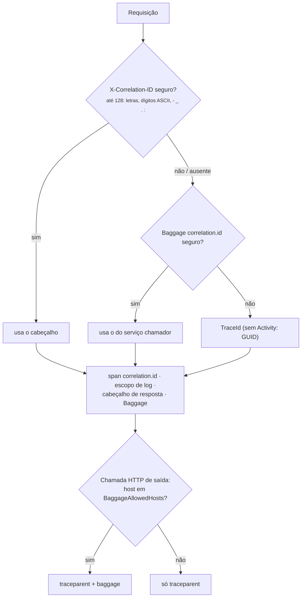

[🏠 TEC.Observability](../README.md) › [📚 Documentação](README.md) › 🔗 Correlation id

# 🔗 Correlation id

> Liga o `X-Correlation-ID` ao trace W3C, aos logs e à resposta, e o propaga só aos hosts autorizados — sem deixar o
> cliente injetar conteúdo em logs nem vazar o id para terceiros.

## 📑 Sumário

- [🎯 Visão geral](#-visão-geral)
- [🚀 Uso](#-uso)
- [⚙️ Opções](#️-opções)
- [❌ Erros](#-erros)
- [🛡️ Segurança](#️-segurança)
- [❓ Perguntas frequentes](#-perguntas-frequentes)

---

## 🎯 Visão geral



| Tipo | Namespace | Membros |
|---|---|---|
| `CorrelationId` | `TEC.Observability.Tracing` | `HeaderName` = `X-Correlation-ID` · `AttributeName` = `correlation.id` · `Current` (valor da requisição atual, `null` fora dela) |

| Situação | Comportamento |
|---|---|
| Requisição traz `X-Correlation-ID` válido | Usado como está |
| Inválido (caractere fora da lista, mais de 128) | Descartado sem erro: vale o Baggage do chamador ou o TraceId |
| Sempre | Atributo `correlation.id` no span, escopo de log `correlation.id` (sem alocar dicionário por requisição), cabeçalho na resposta e item no Baggage W3C |
| Outros itens de `baggage` recebidos | Descartados (OpenTelemetry e `Activity`); `AllowInboundBaggage: true` os mantém |
| Chamada HTTP de saída | `baggage` (e `Correlation-Context`) só para hosts de `BaggageAllowedHosts` (padrão: nenhum); o `traceparent` segue sempre — o serviço chamado usa o TraceId como correlation id |

---

## 🚀 Uso

```csharp
using TEC.Observability.DependencyInjection;
using TEC.Observability.Tracing;

var builder = WebApplication.CreateBuilder(args);
// appsettings.json: "Observability": { "BaggageAllowedHosts": [ "*.svc.cluster.local" ] }
builder.Services.AddTecObservability(builder.Configuration);
builder.Services.AddHttpClient("estoque", c => c.BaseAddress = new Uri("http://estoque-api.loja.svc.cluster.local"));

var app = builder.Build();
app.UseTecObservability();   // antes dos endpoints

app.MapPost("/pedidos", async (IHttpClientFactory factory, ILogger<Program> logger, CancellationToken ct) =>
{
    // traceparent e baggage seguem automaticamente (baggage porque o host casa com "*.svc.cluster.local")
    using var response = await factory.CreateClient("estoque").PostAsync("/reservas", null, ct);
    logger.LogInformation("Reserva respondeu {Status} (correlation {Id})", response.StatusCode, CorrelationId.Current);
    return Results.Accepted();
});

app.Run();
```

Sem `WebApplication`, use `app.UseCorrelationId()` (`IApplicationBuilder`). O middleware deve vir antes dos endpoints e
dos middlewares que registram logs da requisição.

---

## ⚙️ Opções

| Opção | Padrão | Descrição |
|---|---|---|
| `BaggageAllowedHosts` | vazio | Hosts que recebem `baggage`: nome exato (`pedidos-api`), sufixo com curinga (`*.svc.cluster.local`, que não inclui o próprio sufixo) ou `*` (qualquer host) |
| `AllowInboundBaggage` | `false` | Mantém e repassa o `baggage` recebido. Só para serviços com tráfego exclusivamente interno |

---

## ❌ Erros

| Situação | Causa | O que fazer |
|---|---|---|
| `OptionsValidationException`: *BaggageAllowedHosts aceita só nomes de host, '*.sufixo' ou '*'.* | Padrão com espaço ou curinga no meio | Corrija o padrão |
| O serviço chamado não recebe `baggage` | Host fora de `BaggageAllowedHosts` | Inclua o host (ou o sufixo do cluster) |
| `HttpClient` criado antes do pipeline pode enviar `baggage` a hosts fora da lista | O `SocketsHttpHandler` guarda o propagador de quando foi criado | Crie clientes por `IHttpClientFactory`, depois de `Build()` |
| Correlation id da resposta diferente do enviado | O valor enviado tinha caractere fora da lista ou mais de 128 | Use só `A-Z a-z 0-9 - _ . :` |

---

## 🛡️ Segurança

> [!WARNING]
> Nunca use `BaggageAllowedHosts: ["*"]` num serviço que chama APIs de terceiros: o correlation id (e qualquer item de
> Baggage) iria junto.

> [!WARNING]
> O filtro de Baggage é instalado nos propagadores **globais do processo** (do OpenTelemetry e do .NET) e a política
> usada fora de uma requisição é a do último host que subiu. Com dois hosts no mesmo processo, veja
> [estado global](configuracao.md#-estado-global-do-processo).

- O valor do cabeçalho vai para log e cabeçalho de resposta: a lista restrita de caracteres impede injeção (CR/LF,
  marcação, sequências de controle).
- O `baggage` do cliente é descartado por padrão: sem isso, ele seguiria para toda a cadeia de serviços e para os logs.

---

## ❓ Perguntas frequentes

<details>
<summary>Preciso repassar o <code>X-Correlation-ID</code> nas chamadas de saída?</summary>

Não. Ele segue no Baggage (para hosts permitidos) e, sem Baggage, o serviço chamado usa o TraceId do `traceparent` — o
mesmo trace. Repasse o cabeçalho só se o serviço chamado não usar esta biblioteca e exigir `X-Correlation-ID`.

</details>

<details>
<summary>Como ler o correlation id fora de uma requisição (em um job)?</summary>

`CorrelationId.Current` é `null` fora de uma requisição atendida pelo middleware. Em jobs, crie um `Activity` e use o
`TraceId` como identificador.

</details>

---
⬅️ [Health checks](health-checks.md) · [📚 Índice](README.md) · [.NET Aspire](aspire.md) ➡️
