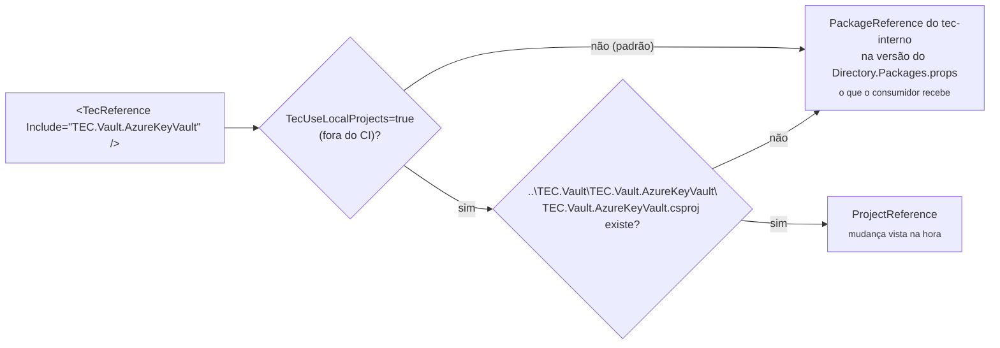

[🏠 TEC.Observability](../README.md) › [📚 Documentação](README.md) › 💻 Desenvolvimento local

# 💻 Desenvolvimento local

> Como compilar, testar e empacotar o TEC.Observability na sua máquina (TEC.* do feed `tec-interno` por padrão, repositórios
> vizinhos sob demanda) e como manter os lock files corretos.

## 📑 Sumário

- [🎯 Visão geral](#-visão-geral)
- [🚀 Uso](#-uso)
  - [Pré-requisitos](#pré-requisitos)
  - [Clonar lado a lado](#clonar-lado-a-lado)
  - [Compilar, testar e empacotar](#compilar-testar-e-empacotar)
  - [Lock files](#lock-files)
  - [Rodar os samples](#rodar-os-samples)
  - [Arquivos canônicos](#arquivos-canônicos)
- [⚙️ Opções](#️-opções)
- [❌ Erros](#-erros)
- [🛡️ Segurança](#️-segurança)
- [❓ Perguntas frequentes](#-perguntas-frequentes)

---

## 🎯 Visão geral

Os dois pacotes **não dependem de nenhum componente TEC**. O único `TecReference` do repositório está no projeto de testes
`TEC.Observability.Azure.Tests`: `<TecReference Include="TEC.Vault.AzureKeyVault" />`, usado para ler a connection string
do cofre de testes. O `build/Tec.Build.targets` decide como resolvê-lo:



| Modo | Quando | Referência | Lock file |
|---|---|---|---|
| Pacote | **Padrão**, na máquina e no CI (`CI=true` sempre usa pacote) | `PackageReference` na versão publicada declarada no `Directory.Packages.props` do feed `tec-interno` | `packages.lock.json` (versionado) |
| Local | Sob demanda: `-p:TecUseLocalProjects=true` fora do CI, com o repositório vizinho presente (sem ele, continua pacote) | `ProjectReference` para o projeto vizinho | `packages.local.lock.json` (fora do git) |

> [!TIP]
> **Versão do TEC.* consumido:** fica no `Directory.Packages.props` deste repositório
> (`<PackageVersion Include="TEC.Vault.AzureKeyVault" Version="0.0.1" />`); o csproj mantém só o `<TecReference>`, sem
> versão. Para usar outra versão publicada, altere esse `PackageVersion` (o Dependabot abre o PR) e regenere os
> `packages.lock.json` ([Lock files](#lock-files)). Os componentes evoluem de forma independente.

O `TEC.Observability.Azure` referencia o `TEC.Observability` por `ProjectReference` dentro do próprio repositório; no
pacote, vira dependência com a mesma versão.

---

## 🚀 Uso

### Pré-requisitos

| Item | Detalhe |
|---|---|
| SDK | .NET 10 (`global.json`: `10.0.100`, `rollForward: latestFeature`) e os runtimes .NET 8 e ASP.NET Core 8 para os testes em `net8.0` |
| Feed `tec-interno` | Para o `TEC.Vault.AzureKeyVault` em modo pacote, o padrão: necessário para compilar a solução inteira (PAT *classic* com `read:packages`; o GitHub Packages exige token mesmo para pacote público) |
| Azure CLI | Só para a integração local (`az login`) |
| Docker | Não é necessário |

```bash
# Credencial do feed (uma vez por máquina, fora do repositório; no Linux/macOS acrescente --store-password-in-clear-text)
dotnet nuget update source tec-interno -u <usuario-github> -p <PAT>
# ou, se a origem ainda não existir no NuGet.Config do usuário:
dotnet nuget add source https://nuget.pkg.github.com/tudoemcodigo/index.json -n tec-interno -u <usuario-github> -p <PAT>
```

### Clonar lado a lado

```text
D:\Projetos\Componentes\
├── tec-workflows\       CI/CD e arquivos canônicos
├── TEC.Core\
├── TEC.Vault\           ⟵ usado só pelos testes de integração do pacote Azure
├── TEC.Cqrs\
├── TEC.Security\
├── TEC.Observability\   este repositório
└── TEC.ORM\
```

Só é necessário para o modo local, sob demanda (ex.: alterar o `TEC.Vault.AzureKeyVault` e testar aqui sem publicar):

```bash
dotnet build TEC.Observability.slnx -p:TecUseLocalProjects=true
dotnet test --project TEC.Observability.Azure.Tests -p:TecUseLocalProjects=true --treenode-filter "/*/*/*/*[Category!=Integracao]"
```

### Compilar, testar e empacotar

```bash
dotnet build TEC.Observability.slnx -c Release
dotnet test --project TEC.Observability.Tests -c Release
dotnet test --project TEC.Observability.Azure.Tests -c Release --treenode-filter "/*/*/*/*[Category!=Integracao]"
dotnet pack TEC.Observability.slnx -c Release -o ./artefatos   # gera só os dois pacotes (IsTecPackage)
```

Cada pacote leva o `README.md` da própria pasta (`TEC.Observability/README.md`, `TEC.Observability.Azure/README.md`), o
logo `Images/Logo.png` e os símbolos (`.snupkg`).

### Lock files

O `packages.lock.json` versionado é sempre o do **modo pacote**, o padrão. No modo local (`-p:TecUseLocalProjects=true`)
o NuGet usa `packages.local.lock.json`, ignorado pelo git. Depois de mudar uma versão em `Directory.Packages.props`:

```bash
dotnet restore TEC.Observability.slnx --force-evaluate
```

> [!WARNING]
> Regenerar o lock versionado (e compilar no modo padrão) exige que as versões TEC.* referenciadas (aqui,
> `TEC.Vault.AzureKeyVault`) **já estejam publicadas** no feed. Até lá, trabalhe em modo local com
> `-p:TecUseLocalProjects=true` (o `packages.local.lock.json` é gerado sozinho e fica fora do git).

### Rodar os samples

```bash
dotnet run -c Release --project samples/TEC.Observability.SampleApi -f net10.0 -- --urls http://127.0.0.1:5080
dotnet run -c Release --project samples/TEC.Observability.LoadGenerator -f net10.0 -- --url http://127.0.0.1:5080
```

Detalhes em [samples/README.md](../samples/README.md).

### Arquivos canônicos

`build/`, `Directory.Build.targets`, `.editorconfig`, `nuget.config`, `.gitignore`, `.gitattributes`, `global.json`,
`LICENSE`, `Images/Logo.png`, `.github/dependabot.yml` e `.github/zizmor.yml` vêm do
[tec-workflows](https://github.com/tudoemcodigo/tec-workflows) e são conferidos pelo CI. **Não edite aqui**: altere no
tec-workflows e sincronize (`tec-workflows/scripts/sync-template.sh TEC.Observability`). Deste repositório são só
`Directory.Build.props` (`TecComponent` e `Version`) e `Directory.Packages.props`.

---

## ⚙️ Opções

| Propriedade MSBuild | Padrão | Efeito |
|---|---|---|
| `TecUseLocalProjects` | `false` (sempre `false` com `CI=true`) | `true` liga o modo local (`ProjectReference` quando o repositório vizinho existe) |
| `TecComponentsRoot` | pasta acima do repositório | Onde procurar os repositórios vizinhos |
| `PackageVersion` dos TEC.* (`Directory.Packages.props`) | `0.0.1` | Versão publicada de cada TEC.* consumido no modo pacote (o Dependabot atualiza) |

---

## ❌ Erros

| Erro | Causa | O que fazer |
|---|---|---|
| `NU1004` / `NU1403` no restore | Lock file desatualizado | `dotnet restore TEC.Observability.slnx --force-evaluate` e commit |
| `NU1101` para `TEC.Vault.AzureKeyVault` | Modo pacote sem a origem `tec-interno` ou pacote não publicado | Configure o feed ou use o modo local (`-p:TecUseLocalProjects=true`) com o `TEC.Vault` clonado ao lado |
| `Use <TecReference ...> em vez de PackageReference` | `PackageReference` para um `TEC.*` | Use `TecReference` |
| Job "Convenções" falha | Arquivo canônico alterado | Desfaça e altere no tec-workflows |

---

## 🛡️ Segurança

> [!CAUTION]
> Nunca grave o PAT no `nuget.config` do repositório: use a configuração do usuário (`dotnet nuget add source` fora da
> pasta) ou variáveis de ambiente. O mesmo vale para a connection string de testes: user-secrets, nunca arquivo versionado.

---

## ❓ Perguntas frequentes

<details>
<summary>Preciso do TEC.Vault para compilar?</summary>

Só para o projeto `TEC.Observability.Azure.Tests`. Por padrão ele vem do feed `tec-interno` (modo pacote; exige a
credencial do feed); o repositório vizinho só é usado com `-p:TecUseLocalProjects=true`. Os dois pacotes e os demais
projetos compilam sem nenhum TEC.*.

</details>

---
⬅️ [Testes](testes.md) · [📚 Índice](README.md) · [README](../README.md) ➡️
