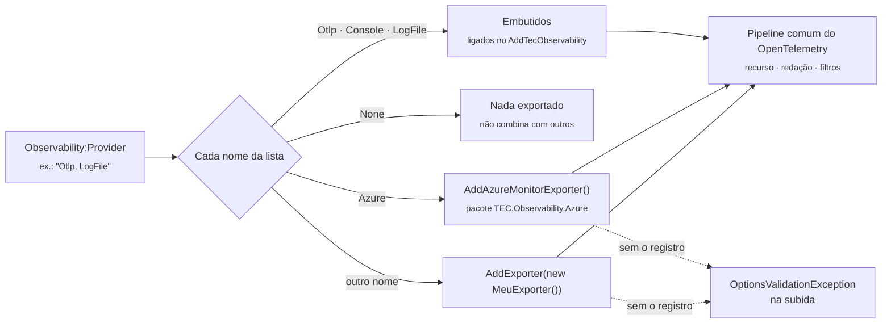

[🏠 TEC.Observability](../README.md) › [📚 Documentação](README.md) › 📤 Exportadores

# 📤 Exportadores

> Para onde vai a telemetria: um ou vários destinos escolhidos em `Observability:Provider`, sem mudar código entre
> ambientes.

## 📑 Sumário

- [🎯 Visão geral](#-visão-geral)
- [🚀 Uso](#-uso)
  - [🔌 OTLP](#-otlp)
  - [☁️ Azure Monitor](#️-azure-monitor)
  - [🖥️ Console e None](#️-console-e-none)
  - [📄 Arquivo de logs (LogFile)](#-arquivo-de-logs-logfile)
  - [🔀 Vários destinos ao mesmo tempo](#-vários-destinos-ao-mesmo-tempo)
  - [🧩 Exportador próprio](#-exportador-próprio)
- [⚙️ Opções](#️-opções)
- [❌ Erros](#-erros)
- [🛡️ Segurança](#️-segurança)
- [❓ Perguntas frequentes](#-perguntas-frequentes)

---

## 🎯 Visão geral



| `Provider` | Pacote | Sinais | Uso típico |
|---|---|---|---|
| `None` (padrão) | base | — | Testes; ou outra biblioteca (Aspire `ServiceDefaults`) já exporta |
| `Otlp` | base | traces, métricas, logs | Qualquer coletor OTLP: AWS ADOT, GCP OTel Collector, Jaeger, Grafana, on-premises |
| `Console` | base | traces, métricas, logs | Desenvolvimento local (síncrono) |
| `LogFile` | base | logs | Arquivo `.txt` local; cópia local junto com outro destino |
| `Azure` | `TEC.Observability.Azure` | traces, métricas, logs | Application Insights |
| nome próprio | o seu | o que o exportador ligar | Backend sem OTLP, ferramenta interna |

Nomes são comparados sem diferenciar maiúsculas; repetidos contam uma vez; a ordem não importa. Por variável de ambiente:
`Observability__Provider=Otlp,LogFile`.

---

## 🚀 Uso

### 🔌 OTLP

```json
{
  "Observability": {
    "ServiceName": "pedidos-api",
    "Environment": "production",
    "Provider": "Otlp",
    "Otlp": { "Endpoint": "https://otel-collector:4317", "Protocol": "Grpc" }
  }
}
```

| Destino | `Endpoint` | `Protocol` |
|---|---|---|
| AWS ADOT Collector (sidecar/daemon) | `http://localhost:4317` | `Grpc` |
| GCP OTel Collector | `http://otel-collector.observability:4317` | `Grpc` |
| Jaeger (OTLP nativo) | `http://jaeger:4317` | `Grpc` |
| Coletor atrás de proxy HTTP | `https://otlp.empresa.com` | `HttpProtobuf` |

- Com `HttpProtobuf`, `/v1/traces`, `/v1/metrics` e `/v1/logs` são acrescentados ao endereço base.
- Sem `Otlp:Endpoint` (nem `Otlp:Headers`), valem as variáveis padrão `OTEL_EXPORTER_OTLP_ENDPOINT`,
  `OTEL_EXPORTER_OTLP_PROTOCOL` e `OTEL_EXPORTER_OTLP_HEADERS` (lidas pelo SDK; definidas, por exemplo, pelo .NET Aspire).
- Ajustes do serviço em `services.Configure<OtlpExporterOptions>(...)` continuam valendo (mesmo nome de opções do SDK).

<details>
<summary>📄 Coletor com chave de API vinda do cofre</summary>

```csharp
using TEC.Observability.DependencyInjection;
using TEC.Vault.AzureKeyVault;

var builder = WebApplication.CreateBuilder(args);
builder.Services.AddTecObservability(builder.Configuration);   // "Provider": "Otlp", "Otlp": { "Endpoint": "https://otlp.empresa.com", "Protocol": "HttpProtobuf" }

// "MinhaApi--Observability--Otlp--Headers--x-api-key" no cofre vira Observability:Otlp:Headers:x-api-key.
// Vale mesmo adicionado depois: os cabeçalhos são lidos na criação do exportador.
builder.Configuration.AddTecVaultAzureKeyVault(
    o => o.VaultUri = new Uri("https://<nome-do-cofre>.vault.azure.net/"),
    c => c.Prefix = "MinhaApi--");

var app = builder.Build();
app.UseTecObservability();
app.Run();
```

</details>

### ☁️ Azure Monitor

Pacote `TEC.Observability.Azure` (não compatível com Native AOT). Usa a distro oficial
`Azure.Monitor.OpenTelemetry.AspNetCore`, que já traz a instrumentação de ASP.NET Core e HttpClient, o sampler do
Application Insights e os três sinais.

```csharp
using TEC.Observability.DependencyInjection;

builder.Services.AddTecObservability(builder.Configuration)
    .AddAzureMonitorExporter();   // opcional: .AddAzureMonitorExporter(o => o.EnableLiveMetrics = false)
```

```json
{
  "Observability": {
    "ServiceName": "pedidos-api",
    "Environment": "production",
    "Provider": "Azure",
    "SamplingRatio": 0.25,
    "Azure": {
      "ConnectionString": "InstrumentationKey=<chave>;IngestionEndpoint=https://<regiao>.in.applicationinsights.azure.com/",
      "UseManagedIdentity": true,
      "ManagedIdentityClientId": "<client-id>",
      "EnableLiveMetrics": true,
      "DisableOfflineStorage": false
    }
  }
}
```

| Comportamento | Detalhe |
|---|---|
| Ativação | `AddAzureMonitorExporter` só liga o exportador quando `Azure` está no `Provider`; o mesmo `Program.cs` serve a todos os ambientes |
| Amostragem | Fração fixa: `SamplingRatio` vira o `SamplingRatio` da distro (o limite por traces/segundo, padrão da distro, é desligado) |
| Credencial com `UseManagedIdentity` | Fora de `Development`: `WorkloadIdentityCredential` → `ManagedIdentityCredential` (sem segredo em variável nem credenciais de desenvolvedor). Em `Development`: `DefaultAzureCredential` |
| Connection string | Obrigatória mesmo com `UseManagedIdentity` (informa o endpoint de ingestão); pode vir de `APPLICATIONINSIGHTS_CONNECTION_STRING` ou de um cofre adicionado depois do registro |
| Redação | A distro desliga a redação de query string da instrumentação; a biblioteca a reaplica ([redacao.md](redacao.md)) |

> [!IMPORTANT]
> Com `UseManagedIdentity`, a identidade precisa do papel **Monitoring Metrics Publisher** no recurso do Application
> Insights. Desative a autenticação local do recurso para que só tokens sejam aceitos.

### 🖥️ Console e None

```json
{
  "Logging": { "Console": { "LogLevel": { "Default": "None" } } },
  "Observability": { "ServiceName": "pedidos-api", "Environment": "development", "Provider": "Console" }
}
```

- `Console`: formato detalhado do exportador de console do OpenTelemetry (traces, métricas e logs). O console padrão do
  .NET (`Logging:Console`) é outro provedor de log; com o nível `None` nele, cada log aparece uma vez.
- `None`: nada é exportado; health checks, correlation id e redação continuam. As fontes do serviço e `TEC.*` são
  registradas em qualquer provedor de OpenTelemetry que outra biblioteca montar no mesmo container.

> [!CAUTION]
> O exportador `Console` é **síncrono**: escreve na thread que encerra o span ou registra o log. Use só em desenvolvimento.

### 📄 Arquivo de logs (LogFile)

Grava **só os logs** num arquivo texto local, uma linha por registro, em lote (a cada segundo ou a cada 512 registros),
fora da thread da aplicação.

```json
{
  "Observability": {
    "ServiceName": "pedidos-api",
    "Environment": "development",
    "Provider": "LogFile",
    "LogFile": {
      "FolderPath": "logs",
      "FileName": "pedidos-api",
      "RollingInterval": "Day",
      "MaxFileSizeBytes": 10485760,
      "RetainedFileCount": 31,
      "MinimumLevel": "Information",
      "IncludeScopes": true
    }
  }
}
```

```text
logs/pedidos-api-20261005.txt
2026-10-05 14:03:22.123 -03:00 [INF] Pedidos.Api.OrderService[1001]: Pedido 42 criado | trace_id=4bf92f35... span_id=00f067aa... | correlation.id=pedido-42
2026-10-05 14:03:23.456 -03:00 [ERR] Pedidos.Api.OrderService: Falha ao gravar | trace_id=... span_id=... | correlation.id=pedido-43
    System.InvalidOperationException: ...
```

| Regra | Detalhe |
|---|---|
| Nome | `{FileName}-{yyyyMMdd}.txt` (`Day`), `{FileName}-{yyyyMMddHH}.txt` (`Hour`) ou `{FileName}.txt` (`None`); passou de `MaxFileSizeBytes`, `_001`, `_002`... no mesmo período |
| Linha | `{data local} [{nível}] {categoria}[{evento}]: {mensagem} \| trace_id=... span_id=... \| {escopos}`; a exceção e as linhas seguintes da mensagem vão recuadas abaixo |
| *Log forging* | Quebras de linha (inclusive `U+0085`, `U+2028`, `U+2029`) viram nova linha **recuada**; demais caracteres de controle (ex.: ANSI `ESC`) são gravados escapados (`\u001B`). Nenhum texto consegue forjar uma linha que pareça outro registro |
| Limites | Mensagem até 32 K caracteres; exceção e cada valor de escopo até 64 K; registro inteiro até 192 K (`MaxRecordLength`: escopos excedentes omitidos com `…[truncado]`) |
| Buffer | Teto real de 256 K caracteres (`MaxBufferedChars`): ao passar, o que está acumulado é gravado e o lote recomeça; pico de memória = teto + um registro. Por isso um lote grande pode se dividir entre arquivos na troca por tamanho |
| Redação | Mensagem, atributos e exceção já chegam redigidos (como em todo exportador); os **escopos** só são redigidos aqui ([redacao.md](redacao.md#-arquivo-de-logs)) |
| Retenção | Apaga os mais antigos além de `RetainedFileCount`, só arquivos do próprio serviço (`pedidos` não apaga os de `pedidos-api`) |
| Falha de disco | Pasta sem permissão ou disco cheio descartam o lote (falha no meio de um lote dividido perde só o restante), sem derrubar a aplicação |
| Fila cheia | O processador em lote descarta o excedente (fila padrão de 2.048 registros): registrar log nunca espera o disco |
| Trace | A instrumentação padrão (ASP.NET Core e HttpClient) é ligada para dar `trace_id`/`span_id` às linhas |

> [!WARNING]
> O arquivo guarda o que os logs trazem. Em contêiner, monte a pasta num volume ou prefira `Otlp`/`Azure` em produção.

### 🔀 Vários destinos ao mesmo tempo

```json
// appsettings.Development.json
{ "Observability": { "Provider": "Console, LogFile" } }

// appsettings.Production.json
{ "Observability": { "Provider": "Azure, LogFile", "LogFile": { "MinimumLevel": "Warning" } } }
```

```csharp
// O mesmo Program.cs para todos os ambientes: cada exportador só é ligado quando está na lista
builder.Services.AddTecObservability(builder.Configuration)
    .AddAzureMonitorExporter();
```

| Exemplo | Resultado |
|---|---|
| `"Console, LogFile"` | Console e arquivo (desenvolvimento) |
| `"Otlp, LogFile"` | Coletor e cópia local dos logs |
| `"Azure, LogFile"` | Azure Monitor e arquivo |
| `"None, Otlp"` | `InvalidOperationException` no registro: `None` não combina |

Todos os destinos compartilham o mesmo pipeline (recurso, redação, filtros); a instrumentação padrão é registrada uma vez.

> [!NOTE]
> Com `Azure` na lista, o sampler efetivo de **todos** os destinos é o `ApplicationInsightsSampler` da distro
> ([amostragem](traces-metricas-logs.md#-amostragem)).

### 🧩 Exportador próprio

```csharp
using Microsoft.Extensions.DependencyInjection;
using Microsoft.Extensions.Options;
using OpenTelemetry;
using OpenTelemetry.Trace;
using TEC.Observability.Exporters;

public sealed class FileSinkOptions
{
    public string Path { get; set; } = "telemetria.log";
}

public sealed class FileSinkTelemetryExporter : ITelemetryExporter
{
    public string Name => "Arquivo";   // "Observability:Provider": "Arquivo" (ou "Arquivo, LogFile")

    public void Configure(TelemetryExporterContext context)
    {
        // Observability:Arquivo -> FileSinkOptions, lido quando o provedor de telemetria é construído
        context.Services.AddOptions<FileSinkOptions>().Bind(context.Section.GetSection("Arquivo"));

        context.AddStandardInstrumentation().OpenTelemetry
            .WithTracing(tracing => tracing.AddProcessor(services =>
            {
                var path = services.GetRequiredService<IOptions<FileSinkOptions>>().Value.Path;
                return new BatchActivityExportProcessor(new MyFileActivityExporter(path));   // seu BaseExporter<Activity>
            }));
    }
}

// Program.cs
builder.Services.AddTecObservability(builder.Configuration)
    .AddExporter(new FileSinkTelemetryExporter());
```

| Membro de `TelemetryExporterContext` | Descrição |
|---|---|
| `OpenTelemetry` | `OpenTelemetryBuilder` já com recurso, métricas de runtime, logs, filtros e as fontes do serviço e `TEC.*` |
| `Services` / `Configuration` | Container e configuração do registro |
| `Section` | Seção `Observability` (as opções do exportador ficam numa subseção) |
| `AddStandardInstrumentation()` | ASP.NET Core e HttpClient (traces e métricas) e `ParentBased(TraceIdRatio(SamplingRatio))`; só a primeira chamada registra. Não chame se o backend traz a sua (como a distro do Azure) |

| Regra | Comportamento |
|---|---|
| Nome entre os destinos do `Provider` | `Configure` é chamado uma vez, no `AddExporter` |
| Nome fora do `Provider` | `AddExporter` não tem efeito (o exportador fica disponível para outros ambientes) |
| Destino sem exportador registrado | A subida falha dizendo o que registrar |

> [!WARNING]
> Leia endereços e credenciais em callbacks com `IServiceProvider`/`IOptions` (na construção do provedor de telemetria),
> não no corpo do `Configure`: assim provedores de configuração tardios valem.

---

## ⚙️ Opções

**`OtlpExporterSettings`** (`Observability:Otlp`)

| Opção | Padrão | Descrição |
|---|---|---|
| `Endpoint` | `OTEL_EXPORTER_OTLP_ENDPOINT` | URL absoluta `http`/`https`, sem usuário e senha; em `HttpProtobuf`, o caminho de cada sinal é acrescentado |
| `Protocol` | `Grpc` | `Grpc` (4317) ou `HttpProtobuf` (4318); só com `Endpoint` definido |
| `Headers` | `OTEL_EXPORTER_OTLP_HEADERS` | Cabeçalhos de cada exportação (chave de API). Nome: letras, dígitos, `-`, `_`; valor sem vírgula nem quebra de linha. Exigem `https` ou endereço local |
| `AllowInsecureTransport` | `false` | Aceita `Headers` por `http` fora da máquina (rede já protegida, ex.: mesh com mTLS) |

**`LogFileExporterSettings`** (`Observability:LogFile`)

| Opção | Padrão | Descrição |
|---|---|---|
| `FolderPath` | `logs` | Pasta; relativa à pasta da aplicação (`AppContext.BaseDirectory`) |
| `FileName` | `ServiceName` | Início do nome, sem pasta nem extensão (caracteres inválidos do `ServiceName` viram `_`) |
| `RollingInterval` | `Day` | `Day`, `Hour` ou `None` |
| `MaxFileSizeBytes` | `10485760` (10 MB) | `0` desliga a troca por tamanho; mínimo 1024 |
| `RetainedFileCount` | `31` | Arquivos mantidos; `0` mantém todos |
| `MinimumLevel` | `Trace` | Nível mínimo só do arquivo, além de `Logging:LogLevel` |
| `IncludeScopes` | `true` | Escopos (ex.: `correlation.id`) no fim da linha |

**`AzureMonitorExporterOptions`** (`Observability:Azure`, pacote Azure; ajustes em código: `.AddAzureMonitorExporter(o => ...)`)

| Opção | Padrão | Descrição |
|---|---|---|
| `ConnectionString` | `APPLICATIONINSIGHTS_CONNECTION_STRING` | Obrigatória, inclusive com `UseManagedIdentity` |
| `UseManagedIdentity` | `false` | Ingestão autenticada pelo Entra ID |
| `ManagedIdentityClientId` | vazio | GUID de uma identidade atribuída pelo usuário; vazio usa a do sistema |
| `EnableLiveMetrics` | padrão da distro (ligado) | Liga/desliga o Live Metrics |
| `DisableOfflineStorage` | padrão da distro (`false`) | `true` não guarda em disco a telemetria que falhou (sistema de arquivos somente leitura) |

---

## ❌ Erros

| Exceção / mensagem | Quando | O que fazer |
|---|---|---|
| `ArgumentException`: *Nome de exportador inválido* | `AddExporter` com nome fora de letras, dígitos, `.`, `-`, `_` (até 64) | Troque o nome |
| `ArgumentException`: *'X' é um provedor embutido...* | Nome `None`, `Otlp`, `Console` ou `LogFile` | Use outro nome |
| `InvalidOperationException`: *Já existe um exportador 'X' registrado.* | `AddExporter` (ou `AddAzureMonitorExporter`) duas vezes com o mesmo nome | Registre uma vez |
| `Otlp:Endpoint é obrigatório (ou a variável OTEL_EXPORTER_OTLP_ENDPOINT).` | `Otlp` sem endereço | Defina o endpoint |
| `Otlp:Endpoint deve ser uma URL absoluta http ou https.` / `... não aceita usuário e senha na URL; use Otlp:Headers.` | Endpoint inválido | Corrija a URL |
| `Otlp:Headers tem nome de cabeçalho inválido...` / `... valor nulo, com vírgula ou com quebra de linha.` | Cabeçalho que o SDK interpretaria errado | Corrija nome/valor |
| `Otlp:Headers (ou a variável OTEL_EXPORTER_OTLP_HEADERS) com endpoint http (sem TLS) enviaria os valores em claro...` | Chave em `http` para outra máquina | `https` ou `AllowInsecureTransport` em rede protegida |
| `LogFile:FolderPath deve ser um caminho de pasta válido.` / `LogFile:FileName deve ser só um nome de arquivo...` | Caminho inválido; nome com pasta, `..` ou caractere inválido | Corrija |
| `LogFile:MaxFileSizeBytes deve ser 0 (sem limite) ou ao menos 1024.` / `LogFile:RetainedFileCount não pode ser negativo...` / `... RollingInterval/MinimumLevel inválido` | Valores fora do intervalo | Corrija |
| `Azure:ConnectionString é obrigatório (ou a variável APPLICATIONINSIGHTS_CONNECTION_STRING), inclusive com UseManagedIdentity.` | Sem connection string | Defina-a |
| `Azure:ManagedIdentityClientId deve ser um GUID.` | Client id inválido | Corrija |
| `NotSupportedException` do SDK na subida | `UseOtlpExporter` (Aspire) e `Provider: Otlp` no mesmo container | Um só exporta ([aspire.md](aspire.md)) |

---

## 🛡️ Segurança

> [!WARNING]
> `Otlp:Headers` e `Azure:ConnectionString` são segredos. Guarde-os num cofre (TEC.Vault) ou em variáveis protegidas.

> [!CAUTION]
> Fora de `Development`, a ingestão no Azure só aceita Workload/Managed Identity: o `DefaultAzureCredential` também
> aceitaria segredo em variável de ambiente e credenciais de desenvolvedor presentes na máquina.

> [!WARNING]
> O exportador próprio recebe a telemetria **já redigida** (os processadores de redação rodam antes de qualquer
> exportador), mas é responsável pelo transporte e armazenamento seguros do que recebe.

---

## ❓ Perguntas frequentes

<details>
<summary>Uso só OTLP. Preciso do pacote Azure?</summary>

Não. `None`, `Otlp`, `Console` e `LogFile` funcionam só com o `TEC.Observability`. O pacote Azure é necessário apenas se
algum ambiente tiver `Azure` no `Provider`.

</details>

<details>
<summary>O <code>LogFile</code> grava traces e métricas?</summary>

Não, só logs. Combine com outro destino (`"Otlp, LogFile"`) para traces e métricas.

</details>

<details>
<summary>Os logs aparecem duas vezes no console</summary>

O `Logging:Console` do .NET e o `Provider: Console` são provedores diferentes. Desligue um deles
(`"Logging": { "Console": { "LogLevel": { "Default": "None" } } }`).

</details>

---
⬅️ [Configuração](configuracao.md) · [📚 Índice](README.md) · [Traces, métricas e logs](traces-metricas-logs.md) ➡️
