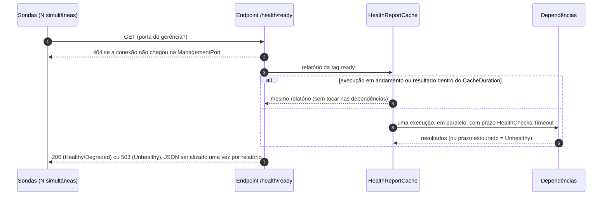

[🏠 TEC.Observability](../README.md) › [📚 Documentação](README.md) › ❤️ Health checks

# ❤️ Health checks

> `/health/live` verifica só o processo; `/health/ready` verifica as dependências — com o mesmo JSON em todos os
> serviços, execução única, cache, prazo e exposição mínima de detalhes.

## 📑 Sumário

- [🎯 Visão geral](#-visão-geral)
- [🚀 Uso](#-uso)
  - [Endpoints de liveness e readiness](#endpoints-de-liveness-e-readiness)
  - [🗄️ Banco de dados](#️-banco-de-dados)
  - [🔑 SSO / provedor de identidade](#-sso--provedor-de-identidade)
  - [🌐 APIs externas e microsserviços](#-apis-externas-e-microsserviços)
  - [🧩 Verificações próprias](#-verificações-próprias)
  - [📄 JSON da resposta](#-json-da-resposta)
- [⚙️ Opções](#️-opções)
- [❌ Erros](#-erros)
- [🛡️ Segurança](#️-segurança)
- [❓ Perguntas frequentes](#-perguntas-frequentes)

---

## 🎯 Visão geral



| Endpoint | Tag | O que verifica | Uso |
|---|---|---|---|
| `/health/live` | `live` | Só o processo (check `self`, nome configurável) | `livenessProbe`: falha reinicia o contêiner |
| `/health/ready` | `ready` | Dependências registradas | `readinessProbe`: falha tira a instância do balanceamento, sem reiniciar |

| Resultado | HTTP |
|---|---|
| `Healthy` ou `Degraded` | **200** |
| `Unhealthy`, prazo estourado ou aplicação encerrando | **503** |
| Conexão fora da `ManagementPort` | **404** (sem executar verificação nenhuma) |

Os endpoints respondem só a `GET`, sem autenticação, fora do OpenAPI, com `Cache-Control: no-store, no-cache`,
`Pragma: no-cache`, `Expires` no passado e `X-Content-Type-Options: nosniff`. No .NET 9+ ficam fora das métricas HTTP.

---

## 🚀 Uso

### Endpoints de liveness e readiness

```csharp
using TEC.Observability.DependencyInjection;

var observability = builder.Services.AddTecObservability(builder.Configuration);

var app = builder.Build();
app.UseTecObservability();   // ou só app.MapTecHealthChecks()
```

| Comportamento | Detalhe |
|---|---|
| Execução única | Requisições simultâneas compartilham **uma** execução por tag, mesmo com o cache desligado |
| Cache | O resultado é reaproveitado por `CacheDuration` (padrão 5 s): uma rajada de sondas não vira carga nas dependências |
| Prazo | `HealthChecks:Timeout` (padrão 30 s) limita a execução inteira; uma verificação que ignora o cancelamento é abandonada e o endpoint responde 503, com `Warning` no log |
| Sem contexto herdado | A execução compartilhada não herda `Activity`, Baggage nem escopos de quem a disparou |
| Corpo | Serializado **uma vez por relatório** e reaproveitado pelas respostas seguintes |
| Tempo | Horários vêm do `TimeProvider` do container (`TryAddSingleton(TimeProvider.System)`): registre outro antes, em testes |

### 🗄️ Banco de dados

Abre uma conexão e executa uma consulta leve com **qualquer** driver ADO.NET (a biblioteca não referencia drivers).

```csharp
builder.Services.AddTecObservability(builder.Configuration)
    // 1. Fábrica do driver + connection string
    .AddDatabaseHealthCheck("PrimaryDb", SqlClientFactory.Instance, connectionString)

    // PostgreSQL, consulta própria, Degraded e timeout
    .AddDatabaseHealthCheck("Relatorios", NpgsqlFactory.Instance, pgConnectionString,
        query: "SELECT 1 FROM pg_database LIMIT 1", failureStatus: HealthStatus.Degraded, timeout: TimeSpan.FromSeconds(3))

    // 2. Qualquer DbConnection
    .AddDatabaseHealthCheck("Legado", () => new OracleConnection(oracleConnectionString), query: "SELECT 1 FROM DUAL")

    // 3. Conexão resolvida pelo container (devolva sempre uma conexão nova)
    .AddDatabaseHealthCheck("RelatoriosDs", sp => sp.GetRequiredService<NpgsqlDataSource>().CreateConnection());
```

| Parâmetro | Padrão | Descrição |
|---|---|---|
| `query` | `SELECT 1` | Consulta leve e **fixa** (nunca montada com entrada de usuário) |
| `failureStatus` | `Unhealthy` | Status em caso de falha |
| `timeout` | 5 s | Vale mesmo com driver que ignora o cancelamento (`CommandTimeout` + espera limitada); precisa ser menor que `HealthChecks:Timeout` |

Tags: `ready` e `database`. A operação abandonada termina em segundo plano, com a falha observada (sem
`UnobservedTaskException`).

### 🔑 SSO / provedor de identidade

Busca o documento de descoberta OpenID Connect e confere que ele traz o `issuer`.

```csharp
builder.Services.AddTecObservability(builder.Configuration)
    // URL do emissor: /.well-known/openid-configuration é acrescentado
    .AddSsoHealthCheck("EntraID", new Uri("https://login.microsoftonline.com/<tenant-id>/v2.0"))
    .AddSsoHealthCheck("KeycloakSSO", new Uri("https://sso.empresa.com/realms/tec"), o =>
    {
        o.Timeout = TimeSpan.FromSeconds(3);
        o.Retries = 0;
        o.Tags.Add("critico");
    });
```

Saudável: resposta 2xx **e** JSON com `issuer` (página de manutenção com 200 conta como falha). O documento é lido até
256 KB. Tags: `ready`, `sso` e as de `Tags`.

### 🌐 APIs externas e microsserviços

GET na URL, saudável com 2xx; falhas transitórias (rede, timeout, 5xx) são repetidas; 4xx não repete.

```csharp
builder.Services.AddTecObservability(builder.Configuration)
    .AddExternalServiceHealthCheck("PaymentGateway", new Uri("https://pagamentos.empresa.com/health/live"), o =>
    {
        o.Timeout = TimeSpan.FromSeconds(2);
        o.Retries = 2;
        o.FailureStatus = HealthStatus.Degraded;   // o serviço ainda atende sem essa dependência
    });
```

Tempo máximo desta verificação: `(Timeout + 1 s) × (Retries + 1)` = `(2 + 1) × 3` = 9 s, que precisa caber em
`HealthChecks:Timeout`. Tags: `ready`, `external` e as de `Tags`.

> [!WARNING]
> Aponte para o **liveness** do serviço chamado, não para o readiness: readiness encadeado faz a queda de uma dependência
> distante derrubar toda a cadeia.

### 🧩 Verificações próprias

```csharp
using TEC.Observability.HealthChecks;

var observability = builder.Services.AddTecObservability(builder.Configuration);
observability.HealthChecks.AddCheck<QueueHealthCheck>("Fila", tags: [HealthCheckTags.Ready]);
```

| Constante de `HealthCheckTags` | Valor | Uso |
|---|---|---|
| `Live` | `live` | Só o processo (falha reinicia) |
| `Ready` | `ready` | Dependências (falha tira do balanceamento) |
| `Database` / `Sso` / `External` | `database` / `sso` / `external` | Tipo da dependência |

> [!NOTE]
> Verificações registradas direto no `IHealthChecksBuilder` não entram na conferência de prazo da subida: garanta que
> terminem antes de `HealthChecks:Timeout`.

Para um endpoint próprio com o mesmo JSON (sem o cache nem a execução única), use o writer público:

```csharp
using Microsoft.AspNetCore.Diagnostics.HealthChecks;
using TEC.Observability.HealthChecks;

app.MapHealthChecks("/health/fila", new HealthCheckOptions
{
    Predicate = r => r.Name == "Fila",
    ResponseWriter = HealthCheckResponseWriter.WriteAsync,
});
```

### 📄 JSON da resposta

Sem detalhes (padrão fora de `Development`):

```json
{ "status": "Unhealthy", "timestamp": "2026-10-01T12:00:00.0000000+00:00" }
```

Com detalhes (`Development`, ou `ExposeDetails: true` com `ManagementPort`):

```json
{
  "status": "Unhealthy",
  "service": "pedidos-api",
  "version": "1.4.2",
  "environment": "production",
  "timestamp": "2026-10-01T12:00:00.0000000+00:00",
  "totalDurationMs": 41.7,
  "checks": [
    {
      "name": "PrimaryDb",
      "status": "Unhealthy",
      "description": "Banco de dados inacessível.",
      "durationMs": 40.2,
      "tags": [ "ready", "database" ],
      "data": {},
      "exception": { "type": "SqlException" }
    },
    {
      "name": "PaymentGateway",
      "status": "Healthy",
      "description": "Dependência acessível.",
      "durationMs": 12.9,
      "tags": [ "ready", "external" ],
      "data": { "statusCode": 200 }
    }
  ]
}
```

- `exception.message` só com `ExposeExceptionDetails: true`; stack trace nunca (a falha completa vai para o log, `Warning`).
- `data` com chave sensível sai `Redacted`; textos são cortados em 1024 caracteres e redigidos ([redacao.md](redacao.md#️-health-checks)).
- O liveness só inclui `startedAt` e `uptimeSeconds` com detalhes ligados.

---

## ⚙️ Opções

**`ObservabilityHealthChecksOptions`** (`Observability:HealthChecks`)

| Opção | Padrão | Descrição |
|---|---|---|
| `Enabled` | `true` | Registra o liveness e mapeia os endpoints |
| `RegisterLivenessCheck` | `true` | Registra o check de liveness da biblioteca (desligue se outra biblioteca já registra o seu) |
| `LivenessCheckName` | `self` | Se já existir um check com esse nome **e a tag `live`** (ex.: o `self` do Aspire), ele é reaproveitado |
| `LiveEndpoint` / `ReadyEndpoint` | `/health/live` / `/health/ready` | Rotas (começam com `/`, diferentes entre si); sempre fora dos traces |
| `CacheDuration` | `00:00:05` | Reaproveitamento do resultado (0 a 1 min; `0` desliga — a execução única continua) |
| `Timeout` | `00:00:30` | Prazo da execução inteira (1 s a 5 min); precisa ser maior que o tempo máximo de cada check da biblioteca |
| `ManagementPort` | vazio | Endpoints só respondem em conexões recebidas nessa porta local (`Connection.LocalPort`); nas demais, 404 |
| `AllowedHosts` | vazio | Restrição por cabeçalho `Host` (`RequireHost`, ex.: `*:8081`) — **só roteamento, não segurança** |
| `ExposeDetails` | automático | Vazio: ligado em `Development`, desligado nos demais. `true` fora de `Development` exige `ManagementPort` |
| `ExposeExceptionDetails` | `false` | Inclui a mensagem da exceção no JSON |

**`HttpHealthCheckOptions`** (em código, para `AddSsoHealthCheck`/`AddExternalServiceHealthCheck`)

| Opção | Padrão | Descrição |
|---|---|---|
| `Timeout` | 5 s | Tempo máximo de cada tentativa (> 0) |
| `Retries` | `1` | Novas tentativas (0 a 5) após falha de rede, timeout ou 5xx; 200 ms entre tentativas |
| `FailureStatus` | `Unhealthy` | `Degraded` mantém o readiness em 200 |
| `Tags` | vazio | Tags além de `ready` e do tipo; itens vazios são recusados |

---

## ❌ Erros

**No registro:**

| Exceção | Quando |
|---|---|
| `ArgumentException`: *Já existe um health check chamado 'X'.* | Nome repetido (inclusive o do liveness) |
| `ArgumentException` | Nome vazio, connection string ou consulta vazia; URL não `http(s)` ou com usuário e senha |
| `ArgumentException`: *Tags não aceita itens vazios.* | `HttpHealthCheckOptions.Tags` com item vazio |
| `ArgumentOutOfRangeException` | `timeout` ≤ 0; `HttpHealthCheckOptions.Timeout` ≤ 0; `Retries` fora de 0–5 |

**Na subida** (`OptionsValidationException` / `InvalidOperationException`):

| Mensagem (trecho) | Causa |
|---|---|
| `O health check 'X' pode levar até Ns (...), o que não cabe em HealthChecks:Timeout (...)` | `(Timeout + 1s) × (Retries + 1)` ou o `timeout` do banco ≥ `HealthChecks:Timeout` |
| `HealthChecks:ExposeDetails=true fora de Development exige HealthChecks:ManagementPort...` | Detalhes sem porta de gerência |
| `HealthChecks:LiveEndpoint deve começar com '/'.` / `... devem ser rotas diferentes.` | Rotas inválidas |
| `HealthChecks:CacheDuration deve estar entre 0 e 1 minuto.` / `HealthChecks:Timeout deve estar entre 1 segundo e 5 minutos.` | Fora do intervalo |
| `HealthChecks:ManagementPort deve estar entre 1 e 65535.` / `HealthChecks:AllowedHosts não aceita itens vazios.` | Valores inválidos |
| `HealthChecks:LivenessCheckName é obrigatório quando RegisterLivenessCheck está ligado.` | Nome vazio |
| `InvalidOperationException`: *Já existe um health check 'self' sem a tag 'live'...* | Check com o nome do liveness sem a tag `live` |

**Em execução** (log `Warning`, sem URL): `Health check 'X' falhou.`, `Health check 'X' falhou (HTTP N).` e
`Health checks da tag 'ready' não terminaram em Ns (HealthChecks:Timeout): respondendo Unhealthy.`

---

## 🛡️ Segurança

> [!WARNING]
> `HealthChecks:AllowedHosts` compara o cabeçalho `Host`, que o cliente escolhe: **não é barreira de segurança**. Para
> restringir, use `ManagementPort` (conferida na conexão) e não publique essa porta no balanceador
> (`ASPNETCORE_HTTP_PORTS=8080;8081`).

> [!CAUTION]
> `ExposeExceptionDetails` revela hosts, usuários e mensagens de banco/HTTP: não ligue em endpoints alcançáveis de fora.

- Sondagens HTTP não seguem redirecionamentos (3xx é falha), não guardam cookies, não enviam `traceparent`/`baggage` e
  usam um `HttpClient` sem os loggers padrão do `IHttpClientFactory` (a URL com query não vai para o log).
- URLs com usuário e senha são recusadas no registro.
- O usuário de banco do health check deve ter só permissão de conexão/consulta simples.

---

## ❓ Perguntas frequentes

<details>
<summary>Por que o readiness responde 200 com uma dependência fora?</summary>

Ela foi registrada com `FailureStatus = Degraded`, que responde 200 por definição. Use `Unhealthy` para dependências sem
as quais o serviço não atende.

</details>

<details>
<summary>Coloco o banco no liveness?</summary>

Não. Um banco fora do ar faria o orquestrador reiniciar todas as instâncias sem resolver nada. Dependências vão no
readiness (tag `ready`).

</details>

<details>
<summary>Durante o deploy o readiness responde 503. É normal?</summary>

Sim: com a aplicação encerrando (`ApplicationStopping`), as verificações são canceladas e o endpoint responde 503, o que
tira a instância do balanceamento antes de ela parar.

</details>

---
⬅️ [Redação de dados sensíveis](redacao.md) · [📚 Índice](README.md) · [Correlation id](correlation-id.md) ➡️
