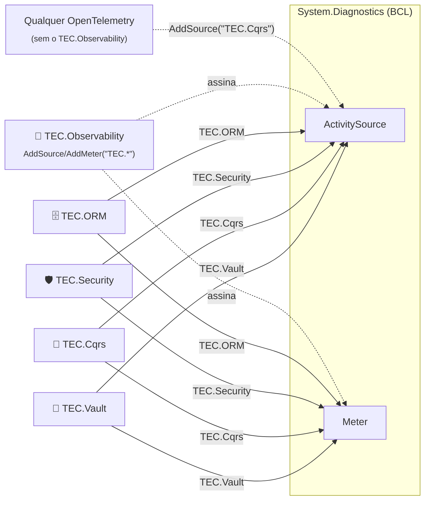

[🏠 TEC.Observability](../README.md) › [📚 Documentação](README.md) › 🧭 Integrações TEC

# 🧭 Integrações TEC

> Por que o TEC.Observability não depende de nenhum componente TEC (e nenhum depende dele), como a telemetria dos
> componentes chega ao mesmo trace e como usar o TEC.Vault para os segredos da observabilidade.

## 📑 Sumário

- [🎯 Visão geral](#-visão-geral)
- [🚀 Uso](#-uso)
  - [Fontes TEC.*](#fontes-tec)
  - [Segredos no TEC.Vault](#segredos-no-tecvault)
  - [Health check do cofre](#health-check-do-cofre)
- [⚙️ Opções](#️-opções)
- [❌ Erros](#-erros)
- [🛡️ Segurança](#️-segurança)
- [❓ Perguntas frequentes](#-perguntas-frequentes)

---

## 🎯 Visão geral



| Regra | Como |
|---|---|
| O TEC.Observability não depende de nenhum TEC.\* em produção | Nenhum `TecReference` nos pacotes; só OpenTelemetry e ASP.NET Core |
| Nenhum componente depende do TEC.Observability | Cada um emite `ActivitySource` e `Meter` da BCL com o nome `TEC.<Componente>`, sem pacote de observabilidade |
| Integração por nome | O TEC.Observability assina o prefixo `TEC.*` (`ServiceCollectionExtensions.TecTelemetryPrefix`); quem não usa o TEC.Observability assina os nomes no próprio OpenTelemetry |
| Sem ciclo | Ordem de publicação: Core → Vault → Cqrs → Security → **Observability** → ORM |

> [!NOTE]
> Os testes de integração do pacote Azure (`TEC.Observability.Azure.Tests`) usam o `TEC.Vault.AzureKeyVault` para ler a
> connection string do cofre de testes — é dependência **só de teste**, não vai para os pacotes.

| Componente | Fonte / medidor | Relação |
|---|---|---|
| 🔐 [TEC.Vault](https://github.com/tudoemcodigo/lib-tec-vault) | `TEC.Vault` | Operações do cofre no trace; chamadas HTTP a cofres do Azure fora dos traces e spans do Azure SDK sem nome e versão do segredo; segredos da observabilidade podem vir dele; health check do cofre no readiness |
| 🧭 [TEC.Cqrs](https://github.com/tudoemcodigo/lib-tec-cqrs) | `TEC.Cqrs` | Spans e métricas do pipeline de commands/queries no mesmo trace da requisição |
| 🛡️ [TEC.Security](https://github.com/tudoemcodigo/lib-tec-security) | `TEC.Security` | Spans e métricas de autenticação/autorização; o provedor de identidade pode entrar no readiness com `AddSsoHealthCheck` |
| 🗄️ [TEC.ORM](https://github.com/tudoemcodigo/lib-tec-orm) | `TEC.ORM` | Spans e métricas de persistência; o banco pode entrar no readiness com `AddDatabaseHealthCheck` |
| 🧰 [TEC.Core](https://github.com/tudoemcodigo/lib-tec-core) | — | Independente |

---

## 🚀 Uso

### Fontes TEC.*

Nada a configurar: com o TEC.Observability registrado, os spans e métricas de qualquer componente `TEC.*` usado no
serviço são exportados, inclusive com `Provider: None` e o pipeline de outra biblioteca (ex.: Aspire `ServiceDefaults`).

```csharp
builder.Services.AddTecObservability(builder.Configuration);   // TEC.Vault, TEC.Cqrs, TEC.Security e TEC.ORM já assinados
```

### Segredos no TEC.Vault

`Otlp:Headers` e `Azure:ConnectionString` são lidos na criação do exportador, então o provedor de configuração do TEC.Vault
vale mesmo adicionado **depois** do `AddTecObservability`:

```csharp
using TEC.Observability.DependencyInjection;
using TEC.Vault.AzureKeyVault;

var builder = WebApplication.CreateBuilder(args);

// 1. Observabilidade (o Provider precisa estar no appsettings.json ou em variáveis)
builder.Services.AddTecObservability(builder.Configuration)
    .AddAzureMonitorExporter();

// 2. Segredos do cofre como configuração:
//    "MinhaApi--Observability--Azure--ConnectionString" -> Observability:Azure:ConnectionString
builder.Configuration.AddTecVaultAzureKeyVault(
    o => o.VaultUri = new Uri("https://<nome-do-cofre>.vault.azure.net/"),
    c => c.Prefix = "MinhaApi--");
```

### Health check do cofre

O health check do TEC.Vault (`AddTecVault` em `IHealthChecksBuilder`) usa as tags `ready` e `vault`, então entra no
`/health/ready` (nunca no liveness):

```csharp
using TEC.Observability.DependencyInjection;
using TEC.Vault.AzureKeyVault;
using TEC.Vault.DependencyInjection;
using TEC.Vault.HealthChecks;

var observability = builder.Services.AddTecObservability(builder.Configuration);

// Cofre no container (exigido pelo health check do cofre)
builder.Services.AddTecVault(vault => vault.UseAzureKeyVault(o => o.VaultUri = new Uri("https://<nome-do-cofre>.vault.azure.net/")));

observability.HealthChecks.AddTecVault();
```

Consulte a [documentação do TEC.Vault](https://github.com/tudoemcodigo/lib-tec-vault) para as opções do cofre.

---

## ⚙️ Opções

| Item | Valor |
|---|---|
| `ServiceCollectionExtensions.TecTelemetryPrefix` | `TEC.*` (fontes e medidores assinados por padrão) |
| `AddActivitySource` / `AddMeter` | Para fontes de outras bibliotecas (ex.: `Azure.*`, `Empresa.*`) |

---

## ❌ Erros

| Situação | Causa | O que fazer |
|---|---|---|
| Spans de um componente TEC não aparecem | Componente sem `ActivitySource` para a operação, ou amostragem | Confira o `SamplingRatio` e a documentação do componente |
| `Provider mudou depois do AddTecObservability` | O `Provider` foi colocado no cofre | O `Provider` precisa estar no `appsettings.json` ou em variáveis |

---

## 🛡️ Segurança

> [!IMPORTANT]
> O nome e a versão dos segredos nunca vão para os traces: chamadas do `HttpClient` a cofres do Azure não geram span e os
> spans do Azure SDK saem com `/secrets/***` e `az.keyvault.*` = `***` ([redacao.md](redacao.md#-traces)).

---

## ❓ Perguntas frequentes

<details>
<summary>Por que não existe um pacote <code>TEC.Cqrs.Observability</code>?</summary>

Não é necessário: os nomes `TEC.<Componente>` da BCL bastam para o OpenTelemetry assinar. Um pacote-ponte só faria sentido
para uma integração que exigisse código dos dois lados.

</details>

<details>
<summary>Uso o TEC.Cqrs sem o TEC.Observability. Consigo os spans?</summary>

Sim: no seu OpenTelemetry, `tracing.AddSource("TEC.Cqrs")` e `metrics.AddMeter("TEC.Cqrs")`.

</details>

---
⬅️ [.NET Aspire](aspire.md) · [📚 Índice](README.md) · [Segurança](seguranca.md) ➡️
