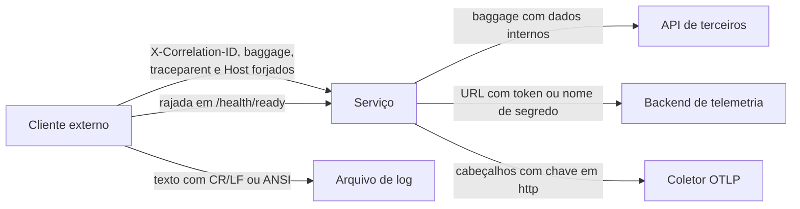

[🏠 TEC.Observability](../README.md) › [📚 Documentação](README.md) › 🛡️ Segurança

# 🛡️ Segurança

> O que o componente garante por padrão, o que fica sob responsabilidade de quem o usa e como configurar produção.
> Telemetria e endpoints de saúde são canais de vazamento comuns: aqui o padrão é expor o mínimo.

## 📑 Sumário

- [🎯 Visão geral](#-visão-geral)
- [🧱 Modelo de ameaças](#-modelo-de-ameaças)
- [✅ Garantias do componente](#-garantias-do-componente)
- [👤 Responsabilidades de quem usa](#-responsabilidades-de-quem-usa)
- [🎲 Amostragem e traceparent externo](#-amostragem-e-traceparent-externo)
- [🌐 Estado global e limites conhecidos](#-estado-global-e-limites-conhecidos)
- [🔐 Configuração recomendada para produção](#-configuração-recomendada-para-produção)
- [🏗️ Build e cadeia de suprimentos](#️-build-e-cadeia-de-suprimentos)
- [❓ Perguntas frequentes](#-perguntas-frequentes)

---

## 🎯 Visão geral



---

## 🧱 Modelo de ameaças

| Ameaça | Mitigação |
|---|---|
| Injeção em logs/cabeçalhos via `X-Correlation-ID` | Aceito só com até 128 caracteres: letras e dígitos ASCII, `-`, `_`, `.`, `:` |
| *Log forging* e sequências ANSI no arquivo de log | Quebras de linha (inclusive `U+0085`, `U+2028`, `U+2029`) viram nova linha recuada; demais controles escapados (`\u001B`) |
| Baggage do cliente propagado pela cadeia | Descartado por padrão (`AllowInboundBaggage: false`) |
| Correlation id e Baggage vazando para terceiros | Enviados só a hosts de `BaggageAllowedHosts` (padrão: nenhum), nos dois propagadores (OpenTelemetry e .NET) |
| Reconhecimento por endpoints anônimos de health | JSON mínimo fora de `Development`; detalhes só com opt-in **e** `ManagementPort` conferida na conexão |
| `Host: x:8081` forjado pela porta pública | `AllowedHosts` não libera detalhes; a restrição real é a `ManagementPort` |
| Rajada de requisições virando carga nas dependências | Execução única por tag, cache (`CacheDuration`) e prazo (`Timeout`) |
| Verificação travada prendendo todas as sondas | Prazo da execução inteira com abandono da verificação |
| Token, senha ou connection string indo para o backend | [Redação](redacao.md) antes de qualquer exportador: nomes sensíveis, query string, credenciais em URL, `Bearer`/`Basic`, pares `chave=valor` |
| Nome/versão de segredo em `url.full` | Chamadas do `HttpClient` a cofres do Azure não geram span; spans do Azure SDK com `/secrets/***` e `az.keyvault.*` = `***` |
| Dados sensíveis no JSON de health | `data` de chave sensível → `Redacted`; textos cortados em 1024 e redigidos; exceção só com `ExposeExceptionDetails`; stack trace nunca |
| Mensagem gigante esgotando memória/disco | Arquivo de log: mensagem até 32 K, exceção/escopos até 64 K, registro até 192 K, buffer com teto de 256 K caracteres; documento OIDC até 256 KB |
| Cliente forçando amostragem com `traceparent` | **Não mitigado** com `ParentBased` ([abaixo](#-amostragem-e-traceparent-externo)) |
| URL de sondagem com token em logs | `HttpClient` das sondagens sem os loggers do `IHttpClientFactory`; falhas registradas sem URL |
| Chave do backend em claro | `Otlp:Headers` (e `OTEL_EXPORTER_OTLP_HEADERS`) só com `https` ou endereço local |
| Credenciais em URL | `Otlp:Endpoint` e URLs de health check com usuário e senha recusados |
| Sonda seguindo redirecionamento para destino arbitrário | `AllowAutoRedirect = false`, sem cookies, sem cabeçalhos de trace |
| Credencial de desenvolvedor usada em produção | Fora de `Development`, ingestão do Azure só com Workload Identity → Managed Identity |

---

## ✅ Garantias do componente

- 🔒 **Configuração validada na subida** (`ValidateOnStart`): o serviço não sobe com telemetria quebrada ou insegura, e as
  mensagens de validação não repetem o valor recebido.
- 🔒 **Redação antes de qualquer exportador**, inclusive os de outra biblioteca registrados antes.
- 🔒 **Endpoints de health** só `GET`, `no-store`, `nosniff`, fora do OpenAPI; liveness sem dados de processo sem
  `ExposeDetails`.
- 🔒 **Execução compartilhada sem herdar contexto**: logs e spans de verificações não carregam o correlation id de quem disparou.
- 🔒 **Consulta de banco fixa**, definida pelo serviço na inicialização.
- 🔒 **Nada de SDK de nuvem no pacote base**: menos superfície e dependências.

---

## 👤 Responsabilidades de quem usa

| Responsabilidade | Como |
|---|---|
| Não registrar segredos nem dados pessoais | A redação é rede de segurança, não controle primário. CPF, e-mail e texto livre não são reconhecidos |
| Não pôr segredos nem dados pessoais em escopos (`BeginScope`) | Escopos não podem ser reescritos pela API do OpenTelemetry: `Otlp`/`Azure`/`Console`/próprio os recebem como registrados ([limites](redacao.md#-logs)) |
| Não registrar exceções só como evento de span | `RecordException`/`AddException` não são redigidos (`ActivityEvent` é imutável): registre a exceção em log ou use `SetStatus(Error, descrição)` ([traces](redacao.md#-traces)) |
| Guardar segredos fora do repositório | `Otlp:Headers` e `Azure:ConnectionString` no cofre ([TEC.Vault](https://github.com/tudoemcodigo/lib-tec-vault)) ou em variáveis protegidas |
| Isolar a porta de gerência | Escute em duas portas (`ASPNETCORE_HTTP_PORTS=8080;8081`) e **não** publique a de gerência no balanceador |
| Listar só hosts internos | `BaggageAllowedHosts` com `*.svc.cluster.local` e nomes de serviços próprios — nunca `*` em serviços que chamam terceiros |
| Não ligar `AllowInboundBaggage` nem `ExposeExceptionDetails` em serviços expostos | Só com tráfego exclusivamente interno / porta de gerência |
| Usar `AllowInsecureTransport` só em rede protegida | Ex.: service mesh com mTLS |
| Privilégio mínimo | Identidade com **Monitoring Metrics Publisher** apenas; usuário de banco do health check só com conexão/consulta simples |
| Criar `HttpClient` depois do pipeline | Use `IHttpClientFactory`; handlers criados antes guardam o propagador anterior |
| Limpar `traceparent` externo | Veja abaixo |

---

## 🎲 Amostragem e traceparent externo

Sem `Azure` no `Provider`, o sampler é `ParentBased(TraceIdRatio(SamplingRatio))`: a decisão vem do `traceparent`
recebido sempre que ele existe. Entre serviços internos é o desejado; vindo de **qualquer cliente**, não:

| Risco | Efeito |
|---|---|
| Cliente envia `traceparent: 00-<trace-id>-<span-id>-01` em toda requisição | Todo trace é amostrado: o `SamplingRatio` é anulado (custo e ruído) |
| Cliente envia `...-00` | O trace da requisição não é exportado |
| Cliente escolhe o `trace-id` | Traces de requisições diferentes agrupados num mesmo id |

| Recomendação | Como |
|---|---|
| Remover `traceparent`/`tracestate` de tráfego externo na borda | Gateway/ingress (ex.: `proxy_set_header traceparent "";` no NGINX, `set-header` com `exists-action="delete"` no API Management, `request_headers_to_remove` no Envoy) |
| Ou deixar a borda decidir | Gateway/collector com amostragem própria que reescreve o `traceparent` |

Com `Azure` no `Provider`, o `ApplicationInsightsSampler` decide por hash do TraceId e ignora o `sampled` do chamador; a
escolha do `trace-id` continua possível, então a limpeza na borda vale igual. O componente não tem opção para ignorar o
`traceparent` recebido.

---

## 🌐 Estado global e limites conhecidos

| Item | Detalhe |
|---|---|
| `BaggageHostPolicy.Default` | Os propagadores do OpenTelemetry e do .NET são **globais do processo**; a política de `BaggageAllowedHosts` usada fora de uma requisição é a do **último host que subiu**. Num processo com um host (o normal), sem efeito ([detalhes](configuracao.md#-estado-global-do-processo)) |
| Exportador `Console` | Síncrono: só para desenvolvimento |
| Redação por heurística | Pode redigir demais (`token: expirado` → `token: Redacted`) — decisão de arquitetura: preferir esconder a vazar |
| Escopos (`BeginScope`) | Não redigidos nos exportadores (só no `LogFile`, ao gravar) |
| Eventos de span (`RecordException`) | Não redigidos: `ActivityEvent` é imutável no .NET |
| Exceção redigida | Com algo a redigir, o exportador recebe `RedactedException` (tipo original no texto e em `OriginalTypeName`; `Exception.Data` não copiado) |
| .NET 8 | Sondas de health entram em `http.server.request.duration` (`DisableHttpMetrics` é do .NET 9) |

> [!WARNING]
> **Escopos e eventos de span não são redigidos** nos exportadores `Otlp`, `Azure`, `Console` e próprios. Não coloque
> segredos nem dados pessoais em `BeginScope`, e registre exceções em log (a exceção do log é redigida para todos os
> exportadores) ou com `SetStatus(ActivityStatusCode.Error, descrição)` em vez de `RecordException`.

---

## 🔐 Configuração recomendada para produção

```json
{
  "Observability": {
    "ServiceName": "pedidos-api",
    "Environment": "production",
    "Provider": "Otlp",
    "Otlp": { "Endpoint": "https://otel-collector:4317" },
    "AllowInboundBaggage": false,
    "BaggageAllowedHosts": [ "*.svc.cluster.local" ],
    "HealthChecks": {
      "ManagementPort": 8081,
      "ExposeDetails": true,
      "ExposeExceptionDetails": false,
      "CacheDuration": "00:00:05",
      "Timeout": "00:00:30"
    }
  }
}
```

> [!IMPORTANT]
> `Otlp:Headers` não aparece acima de propósito: deve vir do cofre (`Observability:Otlp:Headers:<nome>`), lido na criação
> do exportador.

---

## 🏗️ Build e cadeia de suprimentos

| Controle | Detalhe |
|---|---|
| Analisadores | Todo aviso é erro nos pacotes (CA, IDE, IL de AOT/trimming, nullable, CS1591) |
| Auditoria NuGet | `NuGetAudit`: vulnerabilidade quebra o build, inclusive transitiva |
| Lock files | `packages.lock.json` versionado; restore `--locked-mode` no CI |
| `packageSourceMapping` | `TEC.*` só do feed `tec-interno`, o resto do nuget.org |
| SAST | CodeQL `security-extended` em todo PR (dentro do CI central) |
| Pipeline | Actions fixadas por SHA, OIDC sem segredo do Azure, permissões mínimas ([CI/CD](../.github/workflows/README.md#️-segurança)) |

Vulnerabilidades: não abra *issue* pública; escreva para [roberto@roberto.inf.br](mailto:roberto@roberto.inf.br).

---

## ❓ Perguntas frequentes

<details>
<summary>Posso desligar a redação para depurar?</summary>

Não há opção para isso. Use o depurador ou um log local temporário fora do pipeline de exportação — nunca em produção.

</details>

<details>
<summary>O JSON de health em produção só tem status e horário. Como vejo o detalhe?</summary>

Defina `HealthChecks:ManagementPort`, escute nessa porta sem publicá-la e ligue `ExposeDetails: true`. O detalhe completo
das falhas também vai para o log (`Warning`).

</details>

---
⬅️ [Integrações TEC](integracoes-tec.md) · [📚 Índice](README.md) · [Testes](testes.md) ➡️
