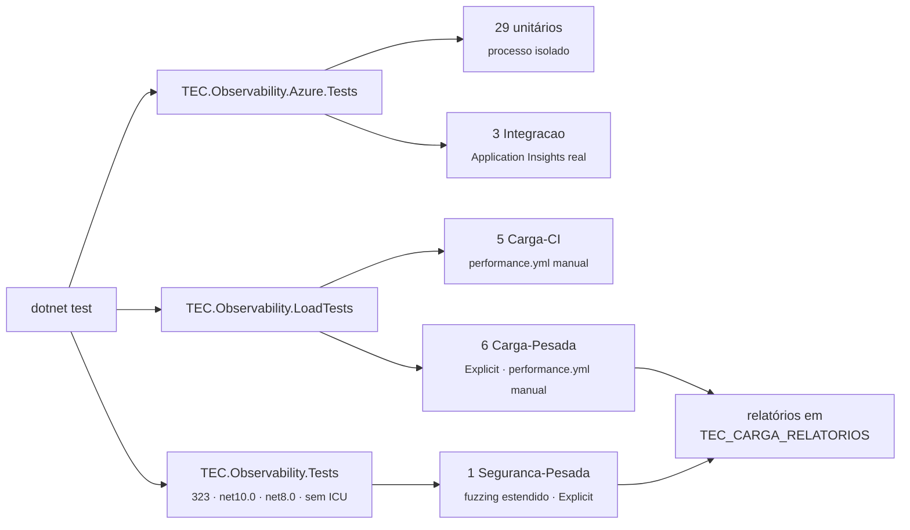
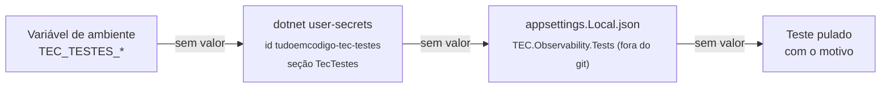

[🏠 TEC.Observability](../README.md) › [📚 Documentação](README.md) › 🧪 Testes

# 🧪 Testes

> Como o TEC.Observability é testado (unidade, segurança, carga, benchmarks e integração com o Application Insights), como
> rodar cada suíte localmente e quais variáveis `TEC_TESTES_*` e `TEC_CARGA_*` existem.

## 📑 Sumário

- [🎯 Visão geral](#-visão-geral)
- [🚀 Uso](#-uso)
  - [Rodar localmente](#rodar-localmente)
  - [Suítes unitárias](#suítes-unitárias)
  - [Testes de segurança](#testes-de-segurança)
  - [Testes de carga](#testes-de-carga)
  - [Benchmarks](#benchmarks)
  - [Integração com o Application Insights](#integração-com-o-application-insights)
  - [No CI](#no-ci)
- [⚙️ Opções](#️-opções)
- [❌ Erros](#-erros)
- [🛡️ Segurança](#️-segurança)
- [❓ Perguntas frequentes](#-perguntas-frequentes)

---

## 🎯 Visão geral



| Projeto | Categoria | Conteúdo | Testes |
|---|---|---|---:|
| `TEC.Observability.Tests` | *(sem categoria)* | Unidade, regressão e segurança rápida do pacote base (sem o pacote Azure) | 323 por alvo |
| `TEC.Observability.Tests` | `Seguranca-Pesada` | Fuzzing estendido (`[Explicit]`) | 1 |
| `TEC.Observability.Azure.Tests` | *(sem categoria)* | Exportador do Azure Monitor e telemetria em processo isolado | 29 |
| `TEC.Observability.Azure.Tests` | `Integracao` | Envio real ao Application Insights de testes e consulta KQL | 3 |
| `TEC.Observability.LoadTests` | `Carga-CI` | Concorrência e fumaça de carga (segundos) | 5 |
| `TEC.Observability.LoadTests` | `Carga-Pesada` | Carga sustentada, rajada de sondas, dependência travada, soak, volume (`[Explicit]`) | 6 |
| `TEC.Observability.Benchmarks` | — | BenchmarkDotNet (fora do `dotnet test`) | — |

| Item | Valor |
|---|---|
| Framework | TUnit sobre o Microsoft.Testing.Platform (`global.json`); FsCheck para propriedades |
| Categorias | Constantes numa classe `TestCategories` por projeto (`Integration`, `LoadCi`, `LoadHeavy`, `SecurityHeavy`) |
| Nomes | Em inglês, descrevendo o comportamento (`Query_string_token_does_not_reach_exported_logs`) |
| Pesados | `[Explicit]`: só rodam quando a categoria é citada no filtro |
| Rede | Só a integração sai da máquina; as demais usam `TestServer` ou Kestrel em `127.0.0.1` |

---

## 🚀 Uso

### Rodar localmente

```bash
# Unitários do pacote base (os dois alvos; precisa do runtime do .NET 8)
dotnet test --project TEC.Observability.Tests -c Release

# Unitários do pacote Azure
dotnet test --project TEC.Observability.Azure.Tests -c Release --treenode-filter "/*/*/*/*[Category!=Integracao]"

# Carga rápida (como no job rapida do performance.yml)
dotnet test --project TEC.Observability.LoadTests -c Release --treenode-filter "/*/*/*/*[Category=Carga-CI]"

# Só um alvo / uma classe (filtro /assembly/namespace/classe/teste)
dotnet test --project TEC.Observability.Tests -c Release -f net10.0 --treenode-filter "/*/*/FuzzingTests/*"

# Sem ICU, como na matriz do CI
DOTNET_SYSTEM_GLOBALIZATION_INVARIANT=1 dotnet test --project TEC.Observability.Tests -c Release -f net10.0
```

> [!WARNING]
> Não use `-nologo` no `dotnet test` com o Microsoft.Testing.Platform: o argumento é repassado ao executável de testes e a
> execução termina com **0 testes** (código de saída 5).

### Suítes unitárias

| Suíte | Projeto | O que cobre |
|---|---|---|
| `ConfigurationTests` | base | Binding, padrões, validação na subida, `IOptionsMonitor`/`IOptionsSnapshot`, provedor tardio, `OTEL_SERVICE_NAME`, versão do assembly de entrada, nomes de `Provider`, filtro de rotas, endpoint OTLP, URL de descoberta |
| `ExporterTests` | base | Exportador próprio ligado pelo nome, não ligado com outro `Provider`, `Provider` sem exportador, nomes embutidos/inválidos/repetidos |
| `HealthCheckTests` | base | Endpoints em `TestServer`, JSON, banco (SQLite e driver falso que ignora cancelamento), SSO e serviço externo simulados, `Degraded`, verificação travada, 503 no encerramento, `self` do Aspire, prazo global |
| `LogFileExporterTests` | base | Formato da linha, quebras de linha e exceção recuadas sem forjar registro, nível mínimo, troca por tamanho e por dia, retenção só dos arquivos do próprio serviço, nome seguro, opções inválidas, vários destinos e exportador próprio juntos, `None` combinado recusado |
| `TelemetryTests` | base | Correlation id e tracing de ponta a ponta com exportador em memória, recurso, fontes `TEC.*`, `None` com OpenTelemetry de outra biblioteca, `OTEL_EXPORTER_OTLP_*`, exportação OTLP |
| `SecurityTests` | base | Regressões: detalhes do JSON por ambiente, Baggage só para hosts permitidos, sondagens e cofres fora dos traces, `ManagementPort`, TLS dos cabeçalhos OTLP, redação de query string e de spans de cofre |
| `Security/SensitiveDataRedactionTests` | base | Nomes sensíveis, texto livre em tempo linear, mensagem refeita pelo modelo como o `ILogger`, atributos de span e URL de saída, arquivo de log (controles escapados, escopos e exceção redigidos), JSON de health (`data` sensível, textos cortados), cache de health com `TimeProvider` injetado, tag vazia recusada no registro |
| `AzureMonitorExporterTests` | Azure | Ativação por `Provider`, opções da distro, connection string tardia e pela variável, validação, credencial só Workload/Managed Identity fora de `Development` |
| `IsolatedTelemetryTests` | Azure | Em processo filho (um host por processo): query string redigida com `Azure`, span do Key Vault sem nome e versão, `IgnoredPaths` com `Azure`, sampler efetivo |

### Testes de segurança

| Classe | Técnica | O que garante |
|---|---|---|
| `Fuzzing/FuzzingTests` | Propriedades FsCheck com entradas hostis (CR/LF, NUL, separadores, `..`, codificação percentual, homóglifos, caracteres invisíveis e de direção, surrogates isolados) | Correlation id só com caracteres seguros (também de ponta a ponta); query redigida no formato da instrumentação e sem expor valores; caminho de cofre e spans de cofre sem nome/versão; nome do arquivo de log nunca sai da pasta; retenção só dos próprios arquivos; Baggage só para host exato ou sufixo; rotas por segmento; JSON de health sempre válido; configuração hostil recusada com mensagem |
| `Adversarial/DosResistanceTests` | Entradas gigantes, streams sem fim, respostas que gotejam | Correlation id de 1 MB trocado sem custo; documento OIDC para em 256 KB; 2 mil sondas contra dependência travada respondem 503 no prazo com **uma** execução; redação e arquivo de log em tempo linear |
| `Adversarial/LeakageTests` | Marcador secreto injetado onde cliente ou dependência controlam | Não sai em spans, logs exportados, arquivo, JSON nem cabeçalhos (`Query_string_token_does_not_reach_spans`, `Query_string_token_does_not_reach_exported_logs`, `Unsafe_correlation_id_with_secret_is_not_echoed_anywhere`, `Validation_message_never_echoes_received_value`...) |
| `FuzzingTests.Extended_fuzzing_of_all_properties` | As mesmas 11 propriedades com `TEC_CARGA_FUZZ_CASOS` casos (padrão 20 mil) e o correlation id de ponta a ponta | Cobertura maior; grava `seguranca.md` em `TEC_CARGA_RELATORIOS` (`Seguranca-Pesada`) |

```bash
dotnet test --project TEC.Observability.Tests -c Release -f net10.0 --treenode-filter "/*/*/*/*[Category=Seguranca-Pesada]"
```

### Testes de carga

Todas as classes rodam uma de cada vez (`[NotInParallel]`): a instrumentação escuta o processo inteiro. A API de exemplo
sobe em Kestrel real com o exportador `Contagem` ([samples](../samples/README.md#o-exportador-contagem)).

| Teste | Categoria | Critério de aprovação |
|---|---|---|
| `ConcurrencyTests.CorrelationId_ConcurrentRequests_NeverLeakBetweenRequests` | `Carga-CI` | Nenhuma requisição recebe correlation id, Baggage ou trace de outra |
| `ConcurrencyTests.Tracing_ConcurrentRequests_EveryServerSpanCarriesItsOwnCorrelationId` | `Carga-CI` | Todo span de servidor com o próprio correlation id e o span filho no mesmo trace |
| `ConcurrencyTests.HealthReadiness_ConcurrentProbes_ShareExecutions` | `Carga-CI` | Execuções da dependência ≤ duração ÷ latência |
| `ConcurrencyTests.LogFile_ConcurrentLogging_NeverBlocksAndWritesWellFormedLines` | `Carga-CI` | Registrar nunca espera o disco; linhas bem formadas, sem registro forjado |
| `SampleApiLoadTests.SmokeLoad_AllScenarios_WithoutErrorsOrTelemetryLeaks` | `Carga-CI` | Zero erros, nenhum span de health, nenhum segredo vazado |
| `SampleApiLoadTests.SustainedLoad_*` | `Carga-Pesada` | Erro ≤ 0,1%, p99 < 2 s, memória retida estável |
| `SampleApiLoadTests.HealthStorm_*` | `Carga-Pesada` | Sondas compartilham execuções; negócio continua atendido |
| `SampleApiLoadTests.HangingDependency_*` | `Carga-Pesada` | Readiness 503 dentro do prazo; negócio não é afetado |
| `SoakTests` | `Carga-Pesada` | Memória, handles e vazão estáveis por minutos |
| `VolumeTests` (2) | `Carga-Pesada` | 1 milhão de registros no `LogFile` com troca e retenção; cada registro gravado uma vez |

```bash
# Pesados (≈ 5 min com os padrões)
dotnet test --project TEC.Observability.LoadTests -c Release -f net10.0 --treenode-filter "/*/*/*/*[Category=Carga-Pesada]"

# Soak de 10 minutos com relatório
TEC_CARGA_SOAK_SEGUNDOS=600 TEC_CARGA_RELATORIOS=./relatorios \
  dotnet test --project TEC.Observability.LoadTests -c Release -f net10.0 --treenode-filter "/*/*/SoakTests/*"
```

### Benchmarks

| Classe | Mede |
|---|---|
| `CorrelationBenchmarks` | Validação do correlation id, política de hosts do Baggage, filtro de rotas |
| `RedactionBenchmarks` | Redação de query string, caminho de cofre e o processador de spans |
| `SensitiveTextBenchmarks` | Varredura de texto livre (com e sem algo a redigir) |
| `HealthBenchmarks` | JSON de health com e sem detalhes e sondagem dentro do cache |
| `PipelineBenchmarks` | Requisição em memória sem a biblioteca × `None` × `Contagem` × `LogFile` |
| `LoggingBenchmarks` | Custo de um log na thread da aplicação |

```bash
dotnet run -c Release --project TEC.Observability.Benchmarks -f net10.0 -- --filter "*"
dotnet run -c Release --project TEC.Observability.Benchmarks -f net10.0 -- --filter "*Redaction*" --runtimes net8.0 net10.0
```

Resultados em `BenchmarkDotNet.Artifacts/results`. Compare sempre na mesma máquina.

### Integração com o Application Insights

Categoria `Integracao`, projeto `TEC.Observability.Azure.Tests`, `net10.0`.

| Teste | Credencial | O que prova |
|---|---|---|
| `Service_telemetry_reaches_application_insights` | Chave da connection string | A ingestão aceita traces, métricas e logs |
| `Entra_id_authenticated_ingestion_is_accepted` | Entra ID (`UseManagedIdentity`) | Ingestão com token (conclusivo com a autenticação local desativada) |
| `Sent_data_shows_up_in_application_insights_queries` | Entra ID (Monitoring Reader) | Os dados aparecem nas tabelas (KQL) e **nenhum** request de `/health` |

O **cofre de testes é a fonte da configuração**: a connection string vem do segredo `tec-testes-appinsights-conexao`, lido
pelo `TEC.Vault.AzureKeyVault` (dependência só de teste) com a credencial dos testes. Com o cofre offline, não configurado
ou sem o segredo, vale a connection string local. Sem nenhuma, os testes são **pulados com o motivo**.



```bash
# Uma vez por máquina (vale para todos os lib-tec-*)
az login --tenant <tenant-id>
dotnet user-secrets set TecTestes:VaultUri https://<cofre-de-testes>.vault.azure.net/ --id tudoemcodigo-tec-testes
dotnet user-secrets set TecTestes:TenantId <tenant-id> --id tudoemcodigo-tec-testes

dotnet test --project TEC.Observability.Azure.Tests -f net10.0 --treenode-filter "/*/*/*/*[Category=Integracao]" --output Detailed
```

| Recurso | Permissão da identidade dos testes |
|---|---|
| `<cofre-de-testes>` | **Key Vault Secrets User** |
| `<recurso-application-insights-de-testes>` | **Monitoring Metrics Publisher** (ingestão) e **Monitoring Reader** (consulta) |

### No CI

| Workflow | Testes |
|---|---|
| `ci.yml` (PR, push na `main`, semanal, manual) | Unitários dos dois projetos em `net10.0`/`net8.0`/sem ICU; integração com o Application Insights de testes via OIDC **só na `main`** (em PR, pula); no push na `main`, publica a prévia |
| `release.yml` | Só os unitários (matriz + cobertura), antes da tag |
| `performance.yml` (só manual) | `suite` = `pesadas` (padrão: `Carga-Pesada` + `Seguranca-Pesada` com parâmetros), `rapida` (`Carga-CI`) ou `todas`; benchmarks opcionais |
| `integracao-azure.yml` (domingo, manual) | Integração em runner self-hosted com identidade gerenciada real (`TEC_TESTES_OBSERVABILITY_IDENTIDADE=workload`) |

Os testes de carga e o `Seguranca-Pesada` não rodam no PR nem na publicação: tempo de parede em runner compartilhado é
ruidoso e não pode bloquear PR nem versão.

Detalhes: [.github/workflows/README.md](../.github/workflows/README.md).

---

## ⚙️ Opções

**Integração** (`TEC_TESTES_*`; chave equivalente no user-secrets/`appsettings.Local.json`):

| Variável | Chave | Padrão | Uso |
|---|---|---|---|
| `TEC_TESTES_VAULT_URI` | `TecTestes:VaultUri` | nenhum (pula) | URI `https` do cofre de testes |
| `TEC_TESTES_TENANT_ID` | `TecTestes:TenantId` (ou `ApplicationInsights:TenantId`) | nenhum | Tenant do Entra ID |
| `TEC_TESTES_OBSERVABILITY_APPINSIGHTS_CONNECTION_STRING` | `ApplicationInsights:ConnectionString` | nenhum | Connection string local, usada só sem o segredo do cofre |
| `TEC_TESTES_OBSERVABILITY_APPINSIGHTS_SEGREDO` | `TecTestes:AppInsightsSegredo` | `tec-testes-appinsights-conexao` | Nome do segredo no cofre |
| `TEC_TESTES_OBSERVABILITY_SERVICE_NAME` | `TecTestes:ServiceName` | `tec-testes-observability` | `cloud_RoleName` da telemetria dos testes |
| `TEC_TESTES_OBSERVABILITY_IDENTIDADE` | — | credenciais do desenvolvedor | `workload`: Workload/Managed Identity e aplicação de teste como `Production` |

> [!NOTE]
> `TEC_TESTES_OBSERVABILITY_CENARIO` e `TEC_TESTES_OBSERVABILITY_ARGUMENTO` são internas: o `IsolatedTelemetryTests` as usa
> para comandar o processo filho. Não as defina.

**Carga e segurança pesada** (`TEC_CARGA_*`; valores inválidos ou vazios usam o padrão):

| Variável | Padrão | Efeito |
|---|---|---|
| `TEC_CARGA_SOAK_SEGUNDOS` | `120` | Duração do soak |
| `TEC_CARGA_API_SEGUNDOS` | `60` | Duração da carga sustentada |
| `TEC_CARGA_API_CONCORRENCIA` | `64` | Conexões simultâneas na carga sustentada |
| `TEC_CARGA_HEALTH_CONCORRENCIA` | `256` | Sondas simultâneas na rajada contra os health checks |
| `TEC_CARGA_LOGS` | `1000000` | Registros do teste de volume do arquivo de logs |
| `TEC_CARGA_FUZZ_CASOS` | `20000` | Casos por propriedade no fuzzing estendido |
| `TEC_CARGA_RELATORIOS` | — | Pasta dos relatórios: `carga.md` (carga) e `seguranca.md` (fuzzing estendido); o CI publica no resumo |

---

## ❌ Erros

| Mensagem / sintoma | Causa | O que fazer |
|---|---|---|
| `Sem Application Insights de testes (Key Vault: Cofre de testes não configurado: ...)` | Sem `TEC_TESTES_VAULT_URI` e sem connection string local | Configure o cofre (user-secrets) ou a connection string local |
| `... segredo tec-testes-appinsights-conexao indisponível em ...` / `vazio em ...` / `... inacessível (...)` | Login, papel *Key Vault Secrets User* ou o segredo | `az login`, papel no cofre, crie o segredo |
| `Sem credencial de desenvolvedor para ... (execute 'az login --tenant <tenant>').` | Sem credencial do Entra ID para ingestão ou consulta | `az login --tenant <tenant-id>` |
| `Sem Workload/Managed Identity disponível para ...` | `TEC_TESTES_OBSERVABILITY_IDENTIDADE=workload` fora do Azure | Rode no runner self-hosted ou tire a variável |
| 0 testes executados (código 5) | `-nologo` no `dotnet test` ou filtro sem casar | Tire o `-nologo`; confira o filtro |
| Testes `net8.0` não rodam | Runtime .NET 8 / ASP.NET Core 8 ausente | Instale ou use `-f net10.0` |
| Pesados não rodam | `[Explicit]` | Filtre pela categoria (`Carga-Pesada`, `Seguranca-Pesada`) |
| Teste de carga conta spans a mais | Outro host no mesmo processo | Mantenha `[NotInParallel]`; leia o exportador em memória por `ToArray()` |

---

## 🛡️ Segurança

> [!WARNING]
> Nenhum recurso real tem valor padrão no código: sem configuração, a integração é **pulada**. Use um cofre e um
> Application Insights **exclusivos de testes**, com identidade de privilégio mínimo.

- Correções de segurança ganham teste de regressão; entradas não confiáveis novas ganham uma propriedade em
  `FuzzingTests`, um caso em `DosResistanceTests` (se houver limite) e em `LeakageTests` (se o valor puder ser sensível).

---

## ❓ Perguntas frequentes

<details>
<summary>Por que o <code>IsolatedTelemetryTests</code> sobe um processo filho?</summary>

A instrumentação do ASP.NET Core e do `HttpClient` assina eventos do processo inteiro: só com um host por processo dá para
conferir o que cada `Provider` produz sem interferência.

</details>

<details>
<summary>Como desligo a integração localmente?</summary>

Não configure o cofre nem a connection string: os testes se pulam com o motivo. Ou filtre por `Category!=Integracao`.

</details>

---
⬅️ [Segurança](seguranca.md) · [📚 Índice](README.md) · [Desenvolvimento local](desenvolvimento.md) ➡️
