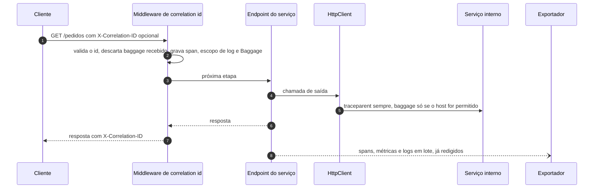

[🏠 TEC.Observability](../README.md) › [📚 Documentação](README.md) › 📊 Traces, métricas e logs

# 📊 Traces, métricas e logs

> O que o pipeline montado pelo `AddTecObservability` registra, como a amostragem e os filtros funcionam e como o serviço
> instrumenta o negócio só com as APIs nativas do .NET.

## 📑 Sumário

- [🎯 Visão geral](#-visão-geral)
- [🚀 Uso](#-uso)
  - [Telemetria de negócio](#telemetria-de-negócio)
  - [Fontes e medidores registrados](#fontes-e-medidores-registrados)
- [🏷️ Recurso](#️-recurso)
- [🎲 Amostragem](#-amostragem)
- [🚫 O que não gera trace](#-o-que-não-gera-trace)
- [⚙️ Opções](#️-opções)
- [🧠 Decisões de implementação](#-decisões-de-implementação)
- [❌ Erros](#-erros)
- [🛡️ Segurança](#️-segurança)
- [❓ Perguntas frequentes](#-perguntas-frequentes)

---

## 🎯 Visão geral



| Sinal | O que entra | Observação |
|---|---|---|
| Traces | Spans de servidor (ASP.NET Core) e de cliente (`HttpClient`), fontes com o nome do `ServiceName`, `TEC.*` e as registradas com `AddActivitySource` | A instrumentação padrão é ligada pelos exportadores `Otlp`, `Console`, `LogFile` e próprios que chamam `AddStandardInstrumentation`; o `Azure` usa a da distro |
| Métricas | ASP.NET Core, `HttpClient`, runtime do .NET (`AddRuntimeInstrumentation`), medidores do `ServiceName`, `TEC.*` e os de `AddMeter` | — |
| Logs | Todo `ILogger` da aplicação, com escopos e mensagem formatada | Ligados ao trace (`trace_id`/`span_id`) e ao escopo `correlation.id` |

Com `Provider: None` não há pipeline próprio: as fontes, os medidores e a redação são registrados em qualquer provedor de
OpenTelemetry que outra biblioteca montar no container (ex.: Aspire `ServiceDefaults`).

---

## 🚀 Uso

### Telemetria de negócio

```csharp
using System.Diagnostics;
using System.Diagnostics.Metrics;
using TEC.Observability.DependencyInjection;

var builder = WebApplication.CreateBuilder(args);
builder.Services.AddTecObservability(builder.Configuration);   // "ServiceName": "pedidos-api"

var app = builder.Build();
app.UseTecObservability();

app.MapPost("/pedidos", (Order order, ILogger<Program> logger) =>
{
    // Telemetria de negócio só com APIs nativas do .NET
    using var activity = OrderTelemetry.Source.StartActivity("ProcessarPedido");
    activity?.SetTag("pedido.id", order.Id);

    OrderTelemetry.Created.Add(1, new KeyValuePair<string, object?>("canal", order.Channel));
    OrderTelemetry.Amount.Record((double)order.Amount);

    logger.LogInformation("Pedido {PedidoId} criado pelo canal {Canal}", order.Id, order.Channel);
    return Results.Created($"/pedidos/{order.Id}", order);
});

app.Run();

record Order(int Id, decimal Amount, string Channel);

static class OrderTelemetry
{
    // Mesmo nome do ServiceName: fonte e medidor já são exportados, sem AddActivitySource/AddMeter
    public const string Name = "pedidos-api";

    public static readonly ActivitySource Source = new(Name);
    private static readonly Meter Meter = new(Name);

    public static readonly Counter<long> Created = Meter.CreateCounter<long>("pedidos.criados", description: "Pedidos criados");
    public static readonly Histogram<double> Amount = Meter.CreateHistogram<double>("pedidos.valor", unit: "BRL");
}
```

> [!TIP]
> Em produção, prefira `[LoggerMessage]` (source generator) a `LogInformation`: sem alocação por chamada. Nos dois casos
> o modelo da mensagem (`{OriginalFormat}`) é preservado e usado pela [redação](redacao.md#-logs).

### Fontes e medidores registrados

| Fonte / medidor | Registrado por padrão? |
|---|---|
| Nome igual ao `ServiceName` | ✅ |
| `TEC.*` (`ServiceCollectionExtensions.TecTelemetryPrefix`) — `TEC.Vault`, `TEC.Cqrs`, `TEC.Security`, `TEC.ORM` | ✅ ([integracoes-tec.md](integracoes-tec.md)) |
| `Azure.*` (spans do Azure SDK) | Só com `Provider: Azure` (a distro registra) ou `AddActivitySource("Azure.*")` |
| Outros nomes | ❌ use `.AddActivitySource(...)` / `.AddMeter(...)` (aceitam curinga, ex.: `Empresa.*`) |

---

## 🏷️ Recurso

Atributos do recurso, lidos das opções efetivas quando o provedor de telemetria é construído:

| Atributo | Origem |
|---|---|
| `service.name` | `ServiceName` (ou `OTEL_SERVICE_NAME`) |
| `service.version` | `ServiceVersion` (ou `AssemblyInformationalVersion` do assembly de entrada) |
| `service.instance.id` | GUID novo por processo (o nome da máquina se repete entre reinícios e entre processos) |
| `host.name` | `Environment.MachineName` |
| `deployment.environment` e `deployment.environment.name` | `Environment` |

---

## 🎲 Amostragem

| `Provider` | Sampler efetivo | Efeito do `traceparent` recebido |
|---|---|---|
| Sem `Azure` (`Otlp`, `Console`, `LogFile`, próprio com `AddStandardInstrumentation`) | `ParentBased(TraceIdRatio(SamplingRatio))` | A decisão do chamador (`sampled`) vence a fração — inclusive a de um cliente externo |
| Com `Azure` (inclusive `"Azure, LogFile"`) | `ApplicationInsightsSampler` da distro, com `SamplingRatio` | Decide por hash do TraceId e ignora o `sampled` do chamador |

> [!WARNING]
> Com `ParentBased`, um cliente externo pode enviar `traceparent ... -01` e anular o `SamplingRatio`. Remova ou ignore o
> `traceparent` de tráfego externo na borda ([seguranca.md](seguranca.md#-amostragem-e-traceparent-externo)).

---

## 🚫 O que não gera trace

| O quê | Como |
|---|---|
| Rotas de `IgnoredPaths` (padrão `/health`, `/health/live`, `/health/ready`, `/swagger`) | Filtro da instrumentação ASP.NET Core, comparado por **segmento** (`/health` ignora `/health/live`, não `/healthcare`) |
| `LiveEndpoint` e `ReadyEndpoint` configurados | Sempre ignorados (mesmo fora de `IgnoredPaths`) |
| Sondagens HTTP dos health checks (`AddSsoHealthCheck`, `AddExternalServiceHealthCheck`) | Marcadas na requisição e filtradas na instrumentação do `HttpClient` |
| Chamadas do `HttpClient` a cofres do Azure (`*.vault.azure.net`, `*.vault.azure.cn`, `*.vault.usgovcloudapi.net`, `*.vault.microsoftazure.de`, `*.managedhsm.azure.net`) | A URL traria nome e versão do segredo; as operações continuam visíveis pelos spans `TEC.Vault` |

Os filtros são compostos com os de quem também registrou a instrumentação (distro do Azure, `ServiceDefaults`, o próprio
serviço): nenhum sobrescreve o outro. Com `Provider: None`, os filtros de rota da biblioteca não são aplicados (valem os
de quem montou o pipeline).

---

## ⚙️ Opções

| Opção | Padrão | Descrição |
|---|---|---|
| `ServiceName` | `OTEL_SERVICE_NAME` | Nome do serviço, da fonte e do medidor padrão |
| `SamplingRatio` | `1.0` | Fração de traces amostrados |
| `IgnoredPaths` | `/health`, `/health/live`, `/health/ready`, `/swagger` | Rotas sem trace (definir substitui a lista) |

Lista completa: [configuracao.md](configuracao.md#️-opções).

---

## 🧠 Decisões de implementação

| Decisão | Motivo |
|---|---|
| OTLP por sinal (`AddOtlpExporter`), não `UseOtlpExporter` | `UseOtlpExporter` não aceita `Headers` definidos em código |
| Exportadores plugáveis (`ITelemetryExporter`) | `Otlp`, `Console` e `LogFile` são exportadores internos, combináveis; os demais entram por `AddExporter`; `Provider` sem exportador é detectado na subida |
| Azure em pacote separado | O pacote base não carrega `Azure.Monitor.OpenTelemetry.AspNetCore` nem `Azure.Identity` e continua compatível com Native AOT |
| Opções lidas tarde | Recurso, amostragem, OTLP e distro leem `IOptions<ObservabilityOptions>` na construção do provedor: provedores de configuração tardios valem |
| Redação antes dos exportadores | Os processadores de redação vão para o **início** da coleção de serviços: rodam antes de qualquer exportador, inclusive os registrados por outra biblioteca antes do `AddTecObservability` |
| Filtros compostos por pós-configuração | Convivem com os da distro do Azure, do `ServiceDefaults` e do serviço |
| `service.instance.id` por processo | Distingue reinícios e réplicas no mesmo host |
| Sem pacote de health check de terceiros | JSON próprio; `Microsoft.Extensions.Diagnostics.HealthChecks` vem do shared framework |

---

## ❌ Erros

| Situação | Causa | O que fazer |
|---|---|---|
| Spans de negócio não aparecem | Fonte com nome diferente do `ServiceName` | `AddActivitySource("NomeDaFonte")` |
| Métricas de negócio não aparecem | Medidor com nome diferente do `ServiceName` | `AddMeter("NomeDoMedidor")` |
| Logs sem `trace_id` | Log fora de uma requisição ou de um span ativo | Normal; dentro de `StartActivity` ele aparece |

---

## 🛡️ Segurança

> [!WARNING]
> Não grave dados pessoais ou segredos em tags (`SetTag`) e logs. A [redação](redacao.md) cobre nomes e formatos
> conhecidos (senha, token, connection string, URL com query), não CPF, e-mail ou texto livre arbitrário.

---

## ❓ Perguntas frequentes

<details>
<summary>Preciso referenciar o OpenTelemetry na aplicação para criar spans?</summary>

Não. `ActivitySource`, `Meter` e `ILogger` são da BCL/`Microsoft.Extensions`. O OpenTelemetry vem como dependência do
pacote e só é usado por ele.

</details>

<details>
<summary>Como ver só os spans de uma rota que está em <code>IgnoredPaths</code>?</summary>

Tire o prefixo de `IgnoredPaths` (definir a lista no `appsettings.json` substitui a padrão). As rotas de health
configuradas continuam sempre fora.

</details>

---
⬅️ [Exportadores](exportadores.md) · [📚 Índice](README.md) · [Redação de dados sensíveis](redacao.md) ➡️
