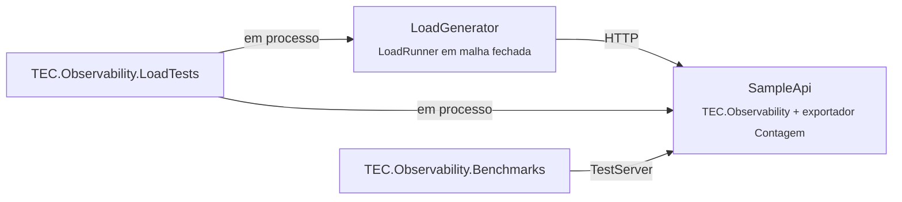

[🏠 TEC.Observability](../README.md) › [📚 Documentação](../docs/README.md) › 🧰 Samples

# 🧰 Samples

> Uma API de exemplo com o TEC.Observability ligado como num serviço real e um gerador de carga HTTP próprio. Servem aos
> testes de carga, aos benchmarks e a quem quer ver a biblioteca funcionando. Não são publicados como pacote.

## 📑 Sumário

- [🎯 Visão geral](#-visão-geral)
- [🌐 TEC.Observability.SampleApi](#-tecobservabilitysampleapi)
  - [Endpoints](#endpoints)
  - [Configuração](#configuração)
  - [O exportador Contagem](#o-exportador-contagem)
- [🏋️ TEC.Observability.LoadGenerator](#️-tecobservabilityloadgenerator)
  - [Opções](#opções)
  - [Cenários](#cenários)
- [🚀 Rodando a carga pela linha de comando](#-rodando-a-carga-pela-linha-de-comando)
- [📈 Lendo o relatório](#-lendo-o-relatório)

---

## 🎯 Visão geral



| Projeto | Depende do TEC.Observability? | Uso |
|---|:---:|---|
| `samples/TEC.Observability.SampleApi` | ✅ | API montada por `SampleApiApp.Create(args)`, também usada pelos testes de carga e benchmarks |
| `samples/TEC.Observability.LoadGenerator` | ❌ (só HTTP) | Gerador de carga (o mesmo `LoadRunner` do TEC.Core), em linha de comando ou em processo nos testes |

---

## 🌐 TEC.Observability.SampleApi

```bash
dotnet run -c Release --project samples/TEC.Observability.SampleApi -f net10.0 -- --urls http://127.0.0.1:5080
```

Sem `--urls`, o perfil de `launchSettings.json` sobe em `http://127.0.0.1:5080` com `ASPNETCORE_ENVIRONMENT=Development`.
Tipos do exemplo: `Order` (categoria dos logs), `NewOrder` (corpo do `POST`), `OrderResponse`, `EchoResponse`,
`ExternalResponse`; o JSON mantém os nomes em português (`cliente`, `itens`, `eco`).

### Endpoints

| Método e rota | Exercita | Resposta |
|---|---|---|
| `GET /pedidos/{id}` | Span `ConsultarPedido`, contador `pedidos.consultados`, log `Information` | Id, correlation id e TraceId |
| `POST /pedidos` `{ "cliente": "...", "itens": n }` | Span `CriarPedido`, contador `pedidos.criados`, histograma `pedidos.itens`; aviso no caminho de validação | 201; 400 com menos de 1 ou mais de 100 itens, ou sem cliente |
| `GET /pedidos/{id}/externo` | `HttpClient` de saída para o próprio serviço (endereço local da conexão, nunca o `Host` — sem SSRF): `traceparent` e Baggage só para `BaggageAllowedHosts` | Correlation id e o `eco` com os cabeçalhos recebidos |
| `GET /interno/eco` | — | Cabeçalhos `baggage` e `traceparent` recebidos |
| `GET /busca?token=...&q=...` | Redação da query string em spans e logs | Tamanho de `q` |
| `GET /erro` | Log de erro com exceção | 500 (`ProblemDetails`) |
| `GET /health/live`, `GET /health/ready` | Endpoints da biblioteca; o readiness verifica a `dependencia-simulada` | 200 / 503 |
| `GET /diagnostico/contadores` | Fora dos traces (`IgnoredPaths`) | Contadores do exportador `Contagem` |

### Configuração

Valores padrão do exemplo (prioridade menor que `appsettings`, variáveis de ambiente e linha de comando):

| Configuração | Padrão | Efeito |
|---|---|---|
| `Observability:ServiceName` | `tec-observability-exemplo` | Também o nome do `ActivitySource` e do `Meter` de negócio |
| `Observability:ServiceVersion` / `Observability:Environment` | `1.0.0` / `exemplo` | Recurso do serviço |
| `Observability:Provider` | `Contagem` | `LogFile`, `Console`, `Otlp` ou combinações (`"Contagem, LogFile"`) também funcionam |
| `Observability:IgnoredPaths` | `/health`, `/swagger`, `/diagnostico` | Rotas sem trace |
| `Observability:BaggageAllowedHosts` | `127.0.0.1`, `localhost` | A chamada de `/externo` é para o próprio serviço |
| `Observability:HealthChecks:CacheDuration` | `00:00:01` | Janela de reaproveitamento do readiness |
| `Observability:LogFile:FolderPath` | `logs` | Pasta do arquivo, quando `LogFile` está no `Provider` |
| `Exemplo:LatenciaDependenciaMs` | `20` | Latência da dependência simulada (valores altos simulam um banco travado) |

### O exportador Contagem

`CountingTelemetryExporter` é um `ITelemetryExporter` do exemplo: liga o pipeline completo da biblioteca (instrumentação
padrão, amostragem, filtros e redação), mas em vez de enviar a telemetria, conta e confere. Assim a carga mede o custo do
TEC.Observability, não o de rede ou disco.

| Contador | Conferência nos testes de carga |
|---|---|
| `ServerSpans`, `ServerSpansWithoutCorrelation` | Todo span de servidor leva o `correlation.id` |
| `HealthSpans` | Sondagens de health nunca geram span |
| `LeakedSpans`, `LeakedLogs` | Nenhum span ou log contém o marcador secreto (`segredo-...` na query string) |
| `SpansEnded`, `BusinessSpans`, `ClientSpans`, `Logs`, `LogsWithTrace`, `MetricExports` | Volume produzido |
| `ReadinessExecutions` | Vezes que a dependência foi verificada: com cache e execução única, independe do número de sondas |

---

## 🏋️ TEC.Observability.LoadGenerator

Gerador em malha fechada: cada worker envia uma requisição, espera a resposta inteira e envia a próxima. Mede RPS,
latência (média, p50, p95, p99, máximo) e erros por cenário.

```bash
dotnet run -c Release --project samples/TEC.Observability.LoadGenerator -f net10.0 -- --url http://127.0.0.1:5080
```

### Opções

| Opção | Padrão | Descrição |
|---|---|---|
| `--url <endereço>` | — (obrigatório) | Endereço base da API |
| `--duracao <s>` | `30` | Segundos medidos |
| `--aquecimento <s>` | `5` | Segundos iniciais fora das estatísticas |
| `--concorrencia <n>` | `32` | Requisições simultâneas |
| `--cenarios <lista>` | mistura padrão | Cenários e pesos: `consultar,criar:50,ready:5` |
| `--semente <n>` | `2026` | Semente dos sorteios |
| `--max-erro <fração>` | `0.01` | Taxa de erro máxima para sair com `0` |
| `--max-p95 <ms>` | — | Latência p95 máxima para sair com `0` |
| `--json <arquivo>` | — | Grava o relatório em JSON |
| `--ajuda` | — | Mostra a ajuda |

Códigos de saída: `0` dentro dos limites, `1` limite violado (ou nenhuma requisição), `2` argumentos inválidos. Timeout
de 30 s por requisição.

### Cenários

| Cenário | Peso | Requisição | Status esperado |
|---|---:|---|:---:|
| `consultar` | 30 | `GET /pedidos/{id}` com `X-Correlation-ID` | 200 |
| `criar` | 15 | `POST /pedidos` com cliente e itens | 201 |
| `externo` | 10 | `GET /pedidos/{id}/externo` | 200 |
| `busca` | 10 | `GET /busca?token=segredo-...&q=...` | 200 |
| `correlacao-insegura` | 5 | `GET /pedidos/{id}` com `X-Correlation-ID` hostil | 200 |
| `invalido` | 5 | `POST /pedidos` sem cliente e com 0 itens | 400 |
| `erro` | 5 | `GET /erro` | 500 |
| `live` | 10 | `GET /health/live` | 200 |
| `ready` | 10 | `GET /health/ready` | 200 |

---

## 🚀 Rodando a carga pela linha de comando

```bash
# Terminal 1: a API
dotnet run -c Release --project samples/TEC.Observability.SampleApi -f net10.0 -- --urls http://127.0.0.1:5080

# Terminal 2: 60 s com 64 conexões, falhando se o erro passar de 0,1% ou o p95 de 50 ms
dotnet run -c Release --project samples/TEC.Observability.LoadGenerator -f net10.0 -- \
  --url http://127.0.0.1:5080 --duracao 60 --concorrencia 64 --max-erro 0.001 --max-p95 50 --json relatorio.json

# Telemetria produzida
curl http://127.0.0.1:5080/diagnostico/contadores
```

```powershell
# Rajada de sondas com a dependência levando 2 s e telemetria também em arquivo
dotnet run -c Release --project samples/TEC.Observability.SampleApi -f net10.0 -- --urls http://127.0.0.1:5080 --Exemplo:LatenciaDependenciaMs 2000 --Observability:Provider "Contagem, LogFile"
dotnet run -c Release --project samples/TEC.Observability.LoadGenerator -f net10.0 -- --url http://127.0.0.1:5080 --cenarios "ready:45,live:45,consultar:10" --concorrencia 256 --duracao 30
```

> [!IMPORTANT]
> Rode o gerador e a API em máquinas diferentes para medir só a API. Gere carga apenas contra ambientes seus ou com
> autorização: tráfego intenso contra terceiros é ataque de negação de serviço.

---

## 📈 Lendo o relatório

```text
Duração: 10.0 s · concorrência: 64 · requisições: 1267046 · RPS: 126705 · erros: 0 (0.00 %)
Latência (ms): média 0.5 · p50 0.2 · p95 0.8 · p99 5.8 · máx 75.6
| Cenário | Requisições | Erros | p50 (ms) | p95 (ms) | p99 (ms) | máx (ms) |
|---|---:|---:|---:|---:|---:|---:|
| consultar | 380122 | 0 | 0.2 | 0.7 | 5.5 | 75.6 |
...
```

- **RPS**: vazão na janela medida (sem o aquecimento). Mais conexões aumentam o RPS até a saturação; depois, só a latência.
- **p95/p99**: a cauda, o que o usuário mais lento sente. Compare execuções com a mesma concorrência e duração.
- **Erros**: listam a causa (`HTTP 500`, `HttpRequestException`, `TaskCanceledException` para timeout).

---
⬅️ [README](../README.md) · [📚 Índice](../docs/README.md) · [Testes](../docs/testes.md) ➡️
